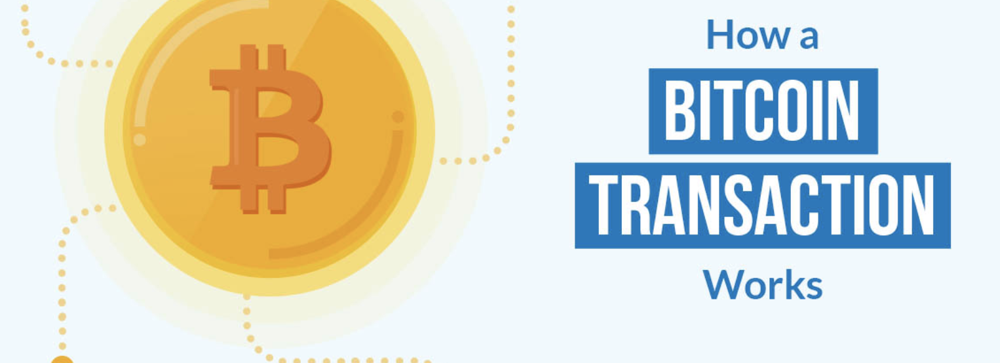
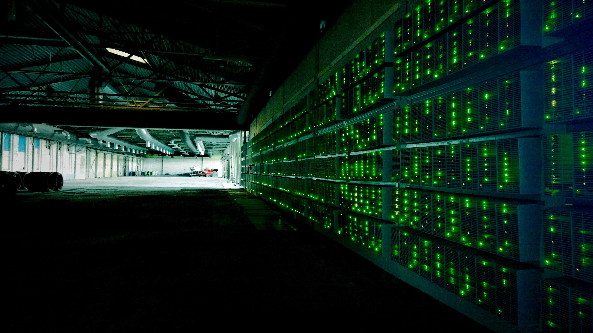
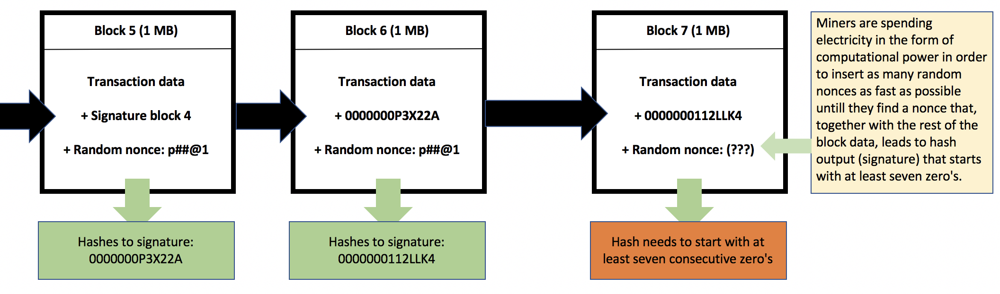

Ever wondered how the mining process on a blockchain works, or how a transaction gets confirmed and is added to the blockchain? So have I. And since I couldn’t find any clear step by step explanation of this process, I decided to write one myself. Here is how a blockchain transaction is processed on a blockchain, in seven steps.
是否想知道在区块链上是如何挖矿的，交易是如何上链的？
没有找到一个清晰的可以一步一步解释这个过程的文章，于是我决定自己写一篇。以下就是我分享的在区块链上矿工7个步骤将数据打包上链。
----------------------
是否想知道区块链上的挖掘过程是如何运作的，或者交易如何得到确认并添加到区块链中？我.由于我找不到任何清晰的一步一步解释这个过程，我决定自己写一个。以下是区块链交易在区块链上的处理方式，分七个步骤。

* **Step 1**: A user signs off on a transaction from their wallet application, attempting to send a certain crypto or token from them to someone else.
第一步：用户进入钱，执行一个交易操作，他将一个加密货币或者一个token发送给另一个用户
---------------
* [ 步骤 1]： 用户从其钱包应用程序注销交易，尝试从他们向其他人发送某个加密或令牌。
* **Step 2**: The transaction is broadcasted by the wallet application and is now awaiting to be picked up by a miner on the according blockchain. As long as it is not picked up, it hovers in a ‘pool of unconfirmed transactions’. This pool is a collection of unconfirmed transactions on the network that are waiting to be processed. These unconfirmed transactions are usually not collected in one giant pool, but more often in small subdivided local pools.
第二部：现在这个交易被钱包广播，等待区块链上的矿工们来拾取它。在被拾取前，它会一直在“未确认交易池”中等待。所有等待被处理的交易都会在未确认交易池中，未确认交易池不是网络上的一个巨大的池，而是很多小的分散的本地池。
-------------------------
* [步骤 2]： 交易由钱包应用程序广播，现在正在等待根据区块链上的矿工接收。只要未选取，它就悬停在"未确认的交易池"中。此池是网络上等待处理的未确认事务的集合。这些未经证实的交易通常不收集在一个巨大的池中，但更常见的是小型细分的本地池。
* **Step 3**: Miners on the network (sometimes referred to as [nodes](https://medium.com/coinmonks/blockchain-what-is-a-node-or-masternode-and-what-does-it-do-4d9a4200938f), but not [quite the same](https://medium.com/@JimiS/blockchain-what-is-a-node-or-masternode-and-what-does-it-do-4d9a4200938f)!) select transactions from these pools and form them into a ‘block’. A block is basically a collection of transactions (at this moment in time, still unconfirmed transactions), in addition to some extra metadata. Every miner constructs their own *block of transactions. *Multiple miners can select the same transactions to be included in their block.
第三步：区块链网络上的矿工(有时叫节点，但不完全一样)从未确认交易池中选择交易打包成数据块。除了一些额外的元数据外，数据块节本上就是交易数据(此时仍然是未确认交易)。每个矿工打包它们自己的交易数据块。多个矿工可以选择同样的交易数据打包。
-----------------
* [步骤 3]： 网络上的矿工（有时称为 [节点]（https：//media.com/硬币僧侣/区块链-什么是节点或主节点-做什么-它做什么-4d9a4200 938f），但不是[完全相同]（https：//media.com/@JimiS/区块链-什么是节点或主节点，做什么-它做什么-4d9a4200938f）！从这些池中选择事务，并将其形成"块"。除了一些额外的元数据外，块基本上是事务的集合（此时，尚未确认的事务）。每个矿工都构建自己的交易块。•多个矿工可以选择相同的事务包含在其块中。

**Example**: two miners, miner A and miner B. Both miner A and miner B can decide to include transaction X into their block. Each blockchain has its own maximum block size. On the Bitcoin blockchain, the maximum block size of one block is 1 MB of data. Before adding a transaction to their block, a miner needs to check if the transaction is eligible to be executed according to the blockchain history. If the sender’s wallet balance has sufficient funds according to the existing blockchain history, the transaction is considered valid and can be added to the block. If a Bitcoin owner wants to speed up their transaction, they can choose to offer a higher mining reward. Miners will usually prioritise transactions such transactions over others, because they provide a better mining reward.

举个例子：两个矿工，矿工A和矿工B都决定打包交易X。每个区块链的数据块都有最大限制。在比特币区块链上，这个最大值是1MB。在打包交易前，矿工需要先根据区块链的历史数据检查这个交易时候有资格被打包。根据区块链历史数据记录，如果支付者的钱包里有足够的余额，这笔交易被认为是有效的，并且可以被打包上链。加入一个比特币持有者想要加速他的交易进度，他可以选择支付更高的挖矿奖励。矿工通常会优先打包这些支付更高挖矿奖励的交易。
------------------------
**[示例]：两名矿工，矿工A和矿工B。矿工 A 和矿工 B 都可以决定将事务 X 包含在其区块中。每个区块链都有自己的最大块大小。在比特币区块链上，一个块的最大块大小是1MB的数据。在将事务添加到其块之前，挖掘者需要根据区块链历史记录检查交易是否有资格执行。如果发件人的钱包余额根据现有的区块链历史记录有足够的资金，则交易被视为有效，可以添加到块中。如果比特币所有者想要加快交易速度，他们可以选择提供更高的采矿奖励。矿工通常会将此类交易优先于其他交易，因为它们提供更好的采矿奖励。**
* **Step 4**: By selecting transactions and adding them to their block, miners create a block of transactions. To add this block of transactions to the blockchain (which means having all the nodes on the blockchain register the transactions in this block), the block first needs a signature (also referred to as a* ‘proof of work’*). This signature is created by solving a very complex mathematical problem that is unique to each block of transactions. Each block has a different mathematical problem, so every miner will work on a different problem unique to the block they formed. Each block’s problem is equally hard to solve. In order to solve this mathematical problem, a lot of *computational power* is used (and thus a lot of electricity). You can compare it to running a calculation on a calculator, only this is much heavier and on done a computer. This is the process referred to as **mining**. If you want to know more about how the mathematical problem works exactly (it’s not actually that complicated), please continue reading *below,* otherwise, in case you want to keep it a little more simple, skip to [step 5.](https://blog.goodaudience.com/how-a-miner-adds-transactions-to-the-blockchain-in-seven-steps-856053271476#92ef)

第四步：矿工的工作就是选择交易数据并打包成块。要把这些块添加到区块链上(这意味着让区块链上所有节点都接受这个块的数据)，这个数据块首先需要签名(也叫“工作证明”)。这个签名是在解决了一个非常复杂的数学问题后得到的，这个签名是独一无二的。每个区块需要解决的数学问题难度是一样的。为了解决这个数学问题，需要耗费相当多的*算力*(所以，要消耗相当多的电力)。你可以将它与在计算器上计算比较一下，这只能通过计算机完成。这个过程就被叫做**挖矿**.如果你想知道更多关于这个数学问题的内容，请继续阅读[比特币如何挖矿-工作量证明](https://learnblockchain.cn/2017/11/04/bitcoin-pow/)，如果你只想简单了解一下，请继续第五步。
-----------------
[ 步骤 4]： 通过选择事务并将其添加到其块中，矿工创建一个事务块。要将此事务块添加到区块链（这意味着让区块链上的所有节点注册此块中的事务），该块首先需要签名（也称为"工作证明"*）。此签名是通过解决每个事务块所独有的非常复杂的数学问题创建的。每个模块都有一个不同的数学问题，所以每个矿工将处理一个不同的问题，独特的块，他们形成。每个块的问题同样难以解决。为了解决这个数学问题，使用了大量的[计算能力]（因此，大量的电力）。您可以将它与在计算器上运行计算进行比较，只有这个更重，在计算机上完成。此过程称为 [挖掘]。如果你想了解更多关于数学问题是如何工作的（它实际上并不复杂），请继续阅读[下面]，否则，如果你想保持它简单一点，跳到[步骤5]。（https://blog.goodaudience.com/how-a-miner-adds-transactions-to-the-blockchain-in-seven-steps-856053271476#92ef）

## Mining aka hashing (Proof of Work consensus algorithm)
挖矿即哈希(工作量证明)
---------------
• 挖掘又名哈希（工作证明共识算法）
The mathematical problem every miner is facing when trying to add a block to the blockchain is to find a **hash output (aka signature) **for the data in its block, that starts with a certain amount of consecutive zero’s. That sounds complicated, right? But it isn’t really that hard. Let me try to explain this to you in a simple way.
矿工在打包块时需要解决的数学问题实际上就是找到一个以一定量的零开头的哈希的输出结果(就是签名)。这听起来很复杂对吗？但是它并不难理解。让我举一个简单的例子来解释吧。

-----------------
当尝试向区块链添加块时，每个挖掘者所面临的数学问题是为其块中的数据查找 _哈希输出（又名签名），该输出从一定量的连续零开始。听起来很复杂，对吧？但其实并不难。让我试着用一个简单的方法向你解释一下。
Before we proceed, it is important to know what a *hash function* is. A hash function is simply put a mathematical problem that is very **hard to solve**, but where the answer is very **easy** to verify.
开始之前，我们需要想了解一下什么是哈希函数。哈希函数很难解，但其结果非常容易验证。
----------------------
在继续之前，了解什么是 [哈希函数] 非常重要。哈希函数只是把一个数学问题，是非常[难以解决]，但答案是非常[容易]验证。
A hash function takes an input string of numbers and letters (literally any string of random letters, numbers and/or symbols), and turns it into a new *32 digit string* existing out of **random** letters and numbers. This 32 digit string is the **hash output**. If any number or letter in the input string is changed, the hash output will also change randomly. However, the same string of input will **always** give the same string of output.

哈希函数的输入值可以是任意字符串，随机输出一个32位的字母和数字的字符串。如果输入中有任何一点小小的变动，输出也将会随机改变。然而，同样的输入字符串只会得到同样的输出。
------------------
哈希函数获取数字和字母的输入字符串（字面上是随机字母、数字和/或符号的任何字符串），并将其转换为新的 [32 位字符串]，现有 [随机] 字母和数字。此 32 位字符串是 [哈希输出]。如果输入字符串中的任何数字或字母发生更改，哈希输出也将随机更改。但是，相同的输入字符串将 [始终] 提供相同的输出字符串。
Now consider the data inside a block to be the **hash input **(a string of data). When this input is hashed, it gives a **hash output** (32 digit string). A rule of the Bitcoin blockchain is that a block can *only* be added to the blockchain if its signature, the hash output, starts with a certain amount of zeros. However, the output string generated by an input string is always random for each different input string, so what if the data string of the block does not lead to a signature (hash output) that starts with so many consecutive zeros? Well, this is why miners repeatedly *change* a part of the data inside their block called the **nonce**. Every time a miner changes the nonce, it slightly changes the composition of the block’s data. And when the composition of the block’s data changes (it’s input), it’s signature (it’s output) also changes. So every time the nonce of a block is changed, the block gets a new random signature.
矿工要打包的数据就是一个字符串，将它进行哈希计算，就会得到一个32位的输出值。比特币区块链有一个规则，要求打包的数据块签名必须以一定数量的零开头。然而哈希计算的输出值是对它的每个输入值都是随机的，那么，输入的字符串哈希后没有得到这么多零开头的值怎么办呢？这就是为什么矿工需要不断的去改变块里面一个叫"nonce"的值，每改变一次nonce的值，就会改变块的数据，哈希运算后得到的签名也会不一样，也就是，每改变一次nonce的值，就会得到一个全新的签名。
-------------------
现在，将块内的数据视为 [哈希输入]（一个数据字符串）。当此输入进行哈希时，它将给出一个 [哈希输出]（32 位字符串）。比特币区块链的一个规则是，如果块的签名（哈希输出）从一定数量的零开始，则可以将块[仅]添加到区块链中。但是，输入字符串生成的输出字符串对于每个不同的输入字符串始终都是随机的，因此，如果数据块的数据字符串不会导致以这么多连续零开头的签名（哈希输出）呢？因此，矿工们反复[改变]他们区块内称为[nonce]的部分数据。每次挖掘者更改 nonce 时，它都会稍微更改块数据的组成。当块的数据组合发生变化（它的输入）时，它的签名（它的输出）也会更改。因此，每次更改块的 nonce 时，该块都会获得一个新的随机签名。
Miners repeat this process of changing the nonce indefinitely until they randomly hit an output string that meets the signature requirements (the zeros). Below illustrates this in an example. This example uses seven zeros, but the amount of zeros really depends on the [block difficulty](https://blog.goodaudience.com/blockchain-the-mystery-of-mining-difficulty-and-block-time-f07f0ee64fd0) of a blockchain. Block difficulty is a little more complicated though, so I suggest you save that for later.
矿工无限次重复改变nonce的值，直到得到一个符合要求的签名。
下面有例子中，签名是以7个零开头的。但是具体需要多少个零，取决于区块链上的区块难度。区块难度相对要难一些，所以我建议你先收藏[block difficulty](https://blog.goodaudience.com/blockchain-the-mystery-of-mining-difficulty-and-block-time-f07f0ee64fd0) 。
------------------------

矿工重复无限期更改 nonce 的过程，直到他们随机命中满足签名要求的输出字符串（零）。下面在一个示例中说明了这一点。此示例使用七个零，但零的数量实际上取决于区块链的 [块难度]（https：//blog.goodause.com/区块链-挖掘-难度-难度-块-时间-f07f0ee64fd0）的奥秘。块困难是有点复杂，虽然，所以我建议你保存以后。

This is how miners need to find an eligible signature to their block, and it is also the reason that so much computational power is needed to solve this mathematical problem. Guessing so many different nonces takes a lot of time and computational power. Also, when more hashing power (miners) joins a blockchain, the difficulty of it’s mathematical problem will increase and lead to higher average electricity expenses to solve a block ([more about this here](https://blog.goodaudience.com/blockchain-the-mystery-of-mining-difficulty-and-block-time-f07f0ee64fd0)). Good work if you followed through, now let’s move on to step 5.
这就是矿工们为什么需要为它们打包的数据块找到一个合格的签名，也是需要那么多算力来解决这个数学问题的原因。试想一下需要这么多此次nonce值需要多少时间和算力呀。此外，当更多的矿工加入到区块链，哈希运算的难度也将增加并且会导致更高的电费支出。现在我们继续第五步。
----------------------------
这就是矿工们需要找到合格签名的原因，这也是需要这么多计算能力来解决这个数学问题的原因。猜测这么多不同的非，需要大量的时间和计算能力。此外，当更多的哈希电源（矿工）加入区块链时，其数学问题的难度将增加，并导致更高的平均电费支出来解决一个块（[这里对此更多]（https：//blog.goodas.com/区块链-神秘的采矿难度和块时间-f07f0ee64fd0））。如果你坚持了，那么工作很好，现在让我们继续走第5步。
Note: This process is actually not defined as a mathematical problem, but rather as a deterministic thing — computers are performing pre-determined operations on a number to see if the output is desirable.
注意：这个过程不是为了定义一个数学问题，而是一个确定的事情——计算机执行一个预先确定的对一个数进行运算看输出是否可用
----------------
注意：此过程实际上不是定义为数学问题，而是作为确定性问题定义 - 计算机对数字执行预先确定的操作，以查看输出是否可取。

* **Step 5**: The miner that finds an eligible signature for its block first, broadcasts this block and its signature to all the other miners.
第五步：矿工找到了一个合格的签名，他就可以向其他所有矿工广播他的数据块和签名。
---------------
* [ 步骤 5]： 矿工首先找到其块的合格签名，向所有其他矿工广播此块及其签名。
* **Step 6**: Other miners now verify the signature’s legitimacy by taking the string of data of the broadcasted block, and hashing it to see if its hash output indeed leads to its included signature of so many zeros (hard to solve, easy to **verify**, remember?). If it is valid, the other miners will confirm its validity and agree that the block can be added to the blockchain (they reach *consensus*, aka they all agree with each other, hence the term consensus algorithm). This is also where the definition ‘proof of work’ comes from. The signature is the ‘proof’ of the work performed (the computational power that was spent). The block can now be added to the blockchain, and is distributed to all other nodes on the network. The other nodes will accept the block and save it to their transaction data as long as all transactions inside the block can be executed according to the blockchain’s history.
第六步：其他矿工现在要确认通过广播收到的数据块的签名合法性，他们要对这个数据块进行哈希运算，检查它是否输出一个以这么多零开头的签名。如果可以，其他矿工就会认为这个数据块有效，并且同意将它添加到区块链上(他们达成了共识，即他们所有矿工都同意彼此，搜易术语叫共识算法)。这也是“工作量证明”的来源。签名就是矿工工作的证明(已花费的算力)，现在，数据块可以加到区块链上了，并且分发到网络上所有其他节点。只要这个数据块中的所有交易数据都跟区块链上的历史数据符合，其他节点将接收这个数据块并将其保存。
-----------------
* [步骤 6]：其他矿工现在通过获取已广播块的字符串来验证签名的合法性，并对其进行哈希处理，以查看其哈希输出是否确实导致包含许多零的签名（难以解决，易于 [验证]，还记得吗？如果有效，其他矿工将确认其有效性，并同意将块添加到区块链（他们达成 [共识]，即他们都同意对方，因此术语共识算法）。这也是"工作证明"这一定义的来源。签名是所执行工作的"证明"（已花费的计算能力）。该块现在可以添加到区块链中，并分发到网络上的所有其他节点。其他节点将接受该块并将其保存到其事务数据中，只要块内的所有事务都可以根据区块链的历史记录执行。

* **Step 7**: After a block has been added to the chain, every other block that is added on top of it counts as a ‘*confirmation’* for that block. For example, if my transaction is included in block 502, and the blockchain is 507 blocks long, it means my transaction has 5 confirmations (507–502). It is referred to as a confirmation because every time another block is added on top of it, the blockchain reaches consensus again on the complete transaction history, including your transaction and your block. You could say that your transaction has been confirmed 5 times by the blockchain at that point. This is also what Etherscan is referring to when showing you your transaction details. The more confirmations your transaction has (aka the deeper the block is embedded in the chain), the harder it is for attackers to alter it ([you can read more about how this works here](https://medium.com/coinmonks/what-is-a-51-attack-or-double-spend-attack-aa108db63474)). After a new block is added to the blockchain, all miners need to start over again at step three by forming a new block of transactions. Miners cannot continue (well, they can, but that is quite irrelevant in this article) mining aka solving the problem of the block they were working on earlier because of two reasons:
第七步：当一个数据块被添加到区块链上后，这条区块链上的所有块都认为它是正确的。例如，我的交易包含在第502号块中，并且这条区块链现在最长是第507号块，它的意思就是说我的交易数据被确认过5次(507-502)。它被认为是正确的，因为每次有其他块上链的时候，区块链都会就所有你是交易记录达成共识，包括你的交易和你的块。你可以说，到这个时候，你交易已经被确认了5次。这也是Etherscan在显示交易详细信息时所指的。你的交易被确认的次数越多(即嵌入区块链越深)，攻击者就越难更改它。每当新的块加入到区块链，所有矿工都需要从第三步重新开始，打包一个新的交易数据块。在完成一个块上链前，矿工们不能继续挖矿，有两个原因：

-----------------------
[ 步骤 7]： 将块添加到链中后，添加到该链上的所有其他块都计为该块的"确认"。例如，如果我的交易包含在块 502 中，并且区块链是 507 个块长，则意味着我的交易有 5 个确认 （507–502）。它被称为确认，因为每次在它上面添加另一个块时，区块链会再次就完整的交易历史达成共识，包括您的交易和您的块。你可以说，你的交易已经确认5次，在那个时候的区块链。这也是 Etherscan 在显示交易详细信息时所指的。您的交易得到的确认越多（又名，块嵌入链中越深），攻击者就越难更改它（[你可以在这里阅读更多关于它是如何工作的]（https：//media.com/coinmonks/what-a-51攻击或双支出攻击-aa108db63474）。将新块添加到区块链后，所有矿工都需要在第三步重新开始，形成一个新的交易块。矿工不能继续（嗯，他们可以，但这在本文中是毫不相干的），挖掘又可以解决他们之前处理的区块的问题，原因有两个：
**One**: it may contain transactions that have been confirmed by the last block that was added to the blockchain (remember, multiple miners can select/include the same transactions(s) in the block they are solving) already. Any of those transactions initiated again could render them invalid, because the source balance might no longer suffice.
1、它可能包含已添加到区块链上已经确认过的交易(请记住，多个矿工可以选择同一个交易数据处理)，任何重新发起的交易都可能导致它们无效，因为支付者的余额可能已经不足。
--------------------
[One]：它可能包含已通过添加到区块链的最后一个块确认的交易（请记住，多个矿工可以选择/包括他们要解决的块中的相同事务）。任何再次启动的事务都可能导致它们无效，因为源余额可能不再足够。
**And two:** every block needs to add the hash output (signature) of the *last block* that was added to the blockchain into* their metadata*. This is what makes it a block*chain*. If a miner keeps mining the block they were already working on, other miners will notice that the hash output does not correspond with that of the latest added block on the blockchain, and will therefore reject the block.
2、每个块都需要将区块链上的最后一个块的哈希签名添加到到他们自己的元数据中。这也是让数据块链起来的原因。假如一个矿工打包的是已经上链的块，其他矿工会注意到它的签名和区块链上最后一个数据块对不上，并且会拒绝这个块。
--------------------

[和两个：]每个块都需要将添加到区块链中的[最后一个块]的哈希输出（签名）添加到其元数据中。这就是它成为块[链]的原因。如果矿工继续挖掘他们已经处理的块，其他矿工会注意到哈希输出与区块链上最新添加的块的输出不对应，因此将拒绝该块。