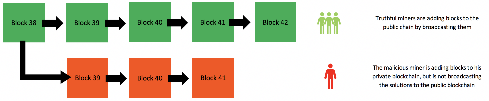
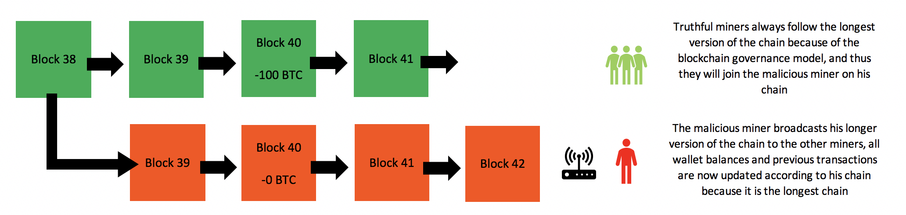
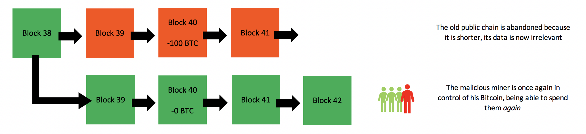
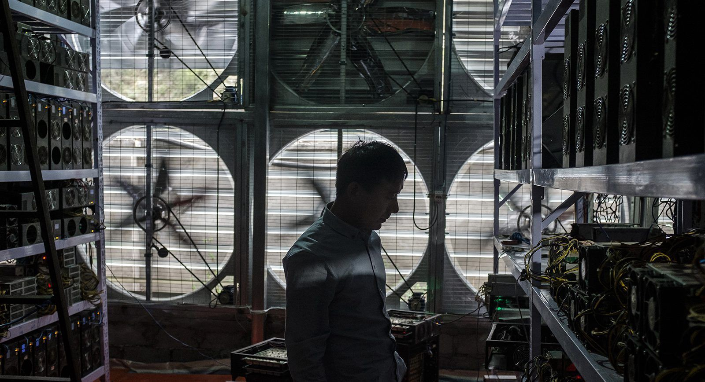
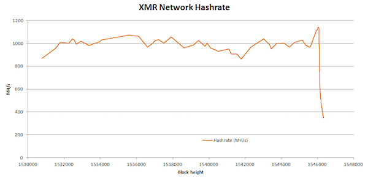
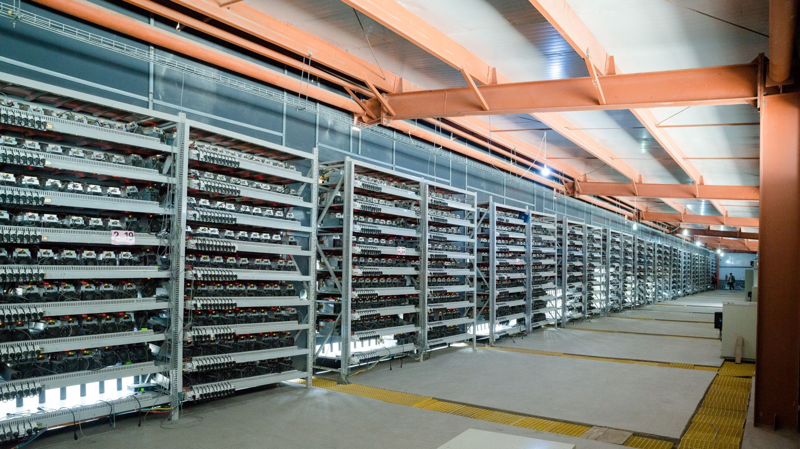
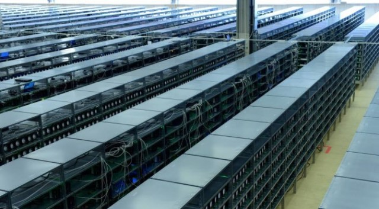

A 51% attack or *double-spend attack* is a miner or group of miners on a blockchain trying to spend their crypto’s on that blockchain **twice**. They try to ‘double spend’ them, hence the name. The goal of this isn’t always to double spend crypto’s, but more often to cast discredit over a certain crypto or blockchain by affecting its integrity.

51%攻击(双花攻击)，因某个矿工或者矿池将一个加密货币多次支付而得名。通常，其目的并不仅是为了重复使用加密货币，而是为了攻击某个区块链网路，破坏它安全性，让它失去人们的信任。

－－－－－－－－－－－－－－

51% 的攻击或 [双倍支出攻击] 是区块链上的矿工或矿工群体，他们试图将他们的加密技术花费在区块链上[两次]。他们试图"双倍消费"他们，因此得名。其目的并不总是重复使用加密，而是更经常地通过影响某个加密或区块链来诋毁其完整性。

Here is a brief example: let’s say I spend 10 Bitcoin on a luxurious car. The car gets delivered a few days later, and my Bitcoins are transferred from me to the car company. By performing a 51% attack on the Bitcoin blockchain, I can now try to *reverse* this Bitcoin transfer. If I succeed, I will possess both the luxurious car *and* my Bitcoins, allowing me to spend those Bitcoins again. The concept of a 51% attack may seem obvious in perspective of a democratic blockchain, but there is a common misconception about how it works. This short article will attempt to give a lucid explanation of how a 51% attack works in more detail. If you don’t know how miners add transactions to the blockchain yet, I suggest you read [how miners add transactions to the blockchain in seven steps](https://medium.com/@Mala44/how-a-miner-adds-transactions-to-the-blockchain-in-seven-steps-856053271476) first, as it is only a five minute read. If you don’t know how a blockchain works, I suggest you start [here](https://medium.com/coinmonks/blockchain-for-beginners-what-is-blockchain-519db8c6677a).

举一个简单的例子：
假设我花了10个比特币买了一辆豪车。几天后，我得到了这辆豪车，并且我支付的比特币也成功转到了汽车公司的账户。通过51%攻击，我可以撤销这笔交易，如果成功，我就相当于不花钱就得到了一辆豪车，我可以再次用这10个比特币去为别的东西支付。从区块链的民主性上来看，51%攻击从理论上讲是明显可行的，但是人们对它的工作原理存在一种常见的误解。在这篇文章中，更详细的解释了如何进行51%攻击。如果你还不是很清楚矿工是如何打包交易数据的，我建议你先花５分钟阅读一下[矿工如何用七个步骤向区块链添加交易](https://medium.com/@Mala44/how-a-miner-adds-transactions-to-the-blockchain-in-seven-steps-856053271476)，如果你还不清楚什么是区块链，我建议你从[这里](https://medium.com/coinmonks/blockchain-for-beginners-what-is-blockchain-519db8c6677a)开始。

－－－－－－－－－－－－－－－－－－－－－－

这里有一个简短的例子：假设我花了10比特币买一辆豪华轿车。几天后，汽车被交付，我的比特币从我转移到汽车公司。通过对比特币区块链执行 51% 的攻击，我现在可以尝试[反向]此比特币转移。如果我成功了，我会同时拥有豪华轿车和我的比特币，让我可以再次消费比特币。从民主区块链的角度来看，51% 的攻击概念似乎显而易见，但人们对它的工作原理存在一种常见的误解。这篇短文将尝试更详细地解释 51% 的攻击的工作原理。如果你还不知道矿工是如何向区块链添加交易的，我建议你先读一下[矿工如何用七个步骤向区块链添加交易]（https：//media.com/@Mala44/如何将矿工-交易添加到区块链-区块链-7步-856053271476），因为它只有5分钟的阅读时间。如果你不知道区块链是如何工作的，我建议你从这里开始（https：//media.com/硬币僧侣/区块链-初学者-什么是区块链-519db8c6677a）。

# [Blockchain = governance](https://medium.com/coinmonks/blockchain-for-beginners-what-is-blockchain-519db8c6677a)
[ 区块链 + 治理]（https：//media.com/硬币僧侣/区块链-初学者-什么是区块链-519db8c6677a）

Before going into detail about a 51% attack, it is important to understand that blockchain protocols are basically a form of *governance*. A blockchain governs a ledger of data, for example transaction data. Because the blockchain protocol can govern this for us, we no longer need a third party to do this, such as a government or bank. This is what makes (most) blockchains *decentralised*. The protocol of the Bitcoin blockchain is based on democracy, meaning that the majority of the participants (miners) on the network will get to decide what version of the blockchain represents the truth.

在详细介绍51%攻击前，我们必须要先知道在区块链网络上，必须按照区块链协议工作。一个区块链管理着一个数据账本，如交易账本。因为区块链协议可以帮我们管理数据，我们不再需要像政府、银行这样的第三方。也就是区块链协议实现了区块链的去中心化。比特币的协议是基于民主的，也就是说，比特币网络上的大多数矿工决定了哪个版本的区块链是正确的。

------------------------------

在详细介绍 51% 的攻击之前，请务必了解区块链协议基本上是一种 [治理] 形式。区块链控制数据分类账，例如事务数据。由于区块链协议可以管理我们，因此我们不再需要第三方来执行此操作，例如政府或银行。这就是（大多数）区块链[分散]的原因。比特币区块链的协议基于民主，这意味着网络上的大多数参与者（矿工）将可以决定区块链的哪一个版本代表真理。

# How a 51% attack works

# 如何实现51%攻击

－－－－－－－－－－－

• 51%攻击如何工作

When a Bitcoin owner signs off on a transaction, it is put into a local pool of unconfirmed transactions. Miners select transactions from these pools to form a block of transactions. In order to add this block of transactions to the blockchain, they need to find a solution to a very difficult mathematical problem. They try to find this solution using computational power. This is called **hashing**** (**[**read more about the hashing algorithm here**](https://medium.com/coinmonks/blockchain-for-beginners-what-is-blockchain-519db8c6677a)**)**. The more computational power a miner has, the better their chances are to find a solution before other miners find theirs. When a miner finds a solution, it will be broadcasted (along with their block) to the other miners and they will *only verify* it if all transactions inside the block are *valid* according to the existing record of transactions on the blockchain. **Note that even a corrupted miner can never create a transaction for someone else because they would need the *digital signature* of that person in order to do that (their private key)**. Sending Bitcoin from someone else’s account is therefore simply impossible without access to the corresponding private key.

当一个比特币拥有者执行一个交易操作时，交易数据会先被存入本地交易池等待确定。矿工会从这些本地交易池中选择交易数据打包。为了要把数据打包上链，矿工需要解决一个非常复杂的数学问题，矿工通过计算机来做哈希计算并找到答案。（[在此处阅读有关哈希算法的更多信息](https://medium.com/coinmonks/blockchain-for-beginners-what-is-blockchain-519db8c6677a)）
矿工拥有更多的算力，就会拥有比别人更大的机会找到答案。一旦某个矿工找到了答案，他就可以向全网广播(包括打包好的数据块)，其他矿工就会根据区块链上已有的记录检查这个数据块是否有效。**请注意，攻击者矿工不可能为其他人创建交易，因为创建交易需要本人的数字签名(私钥)。因此，在没有访问到对应的私钥时，从别人的账户发送比特币是不可能的。**

－－－－－－－－－－－－－－

当比特币所有者在交易上签到时，它被放入一个未经确认的本地交易池中。矿工从这些池中选择事务以形成事务块。为了将这个交易块添加到区块链中，他们需要找到解决一个非常困难的数学问题的方法。他们试图用计算能力找到这个解决方案。这称为 [哈希] （[在此处阅读有关哈希算法的更多信息]（https：//media.com/coinmonks/区块链-初学者-什么是区块链-519db8c6677a））*。矿工的计算能力越强，他们就越有可能在其他矿工找到解决方案之前找到解决方案。当矿工找到解决方案时，它将与其他矿工广播（连同其块），并且他们将[仅验证]如果块内的所有交易都根据区块链上现有的交易记录[有效]。[请注意，即使损坏的矿工也永远无法为其他人创建交易，因为他们需要此人的 [数字签名] 才能做到这一点（其私钥）]。因此，如果无法访问相应的私钥，则从他人的帐户发送比特币是不可能的。

# Stealth mining — creating an offspring of the blockchain

# 隐身挖掘 • 创建区块链的后代

Now pay attention. A malicious miner *can* however, try to *reverse**** ***existing* *transactions. When a miner finds* *a solution, it is supposed to be broadcasted to all other miners so that they can verify it whereafter the block is added to the blockchain (the miners reach *consensus*). However, a corrupt miner can create *an offspring* of the blockchain by **not **broadcasting the solutions of his blocks to the rest of the network. There are now **two versions***** ***of the blockchain.

现在，请注意，攻击者矿工可以尝试撤销现存的交易。当一个矿工打包好一个块时，它本应该广播给其他矿工检查并添加到后续区块链上(这是矿工们的共识)。但是，攻击者矿工可以不广播，而继续在他自己打包的块后面不断打包新的数据块，创建一个别人不知道的分支链。现在网络上就存在两条区块链。

－－－－－－－－－－－－

现在注意。但是，恶意矿工可以尝试 [反向] [现有] [事务]当矿工发现[解决方案]时，应该将其广播给所有其他矿工，以便他们可以在块添加到区块链后对其进行验证（矿工达成 [共识]）。然而，腐败的矿工可以通过[不将其模块的解决方案广播到网络的其余部分]来创建区块链的[后代]。区块链现在有两个版本。

There are now two versions of the blockchain. The red blockchain can be considered in ‘stealth’ mode.

如上图出现了红色和绿色两条区块链，其中红色区块链被认为是隐身模式。

－－－－－－－－－－－－－－－

区块链现在有两个版本。红色区块链可以在"隐身"模式下考虑。

One version that is being followed by the uncorrupted miners, and one that is being followed by the corrupted miner. The corrupted miner is now working on his own version of that blockchain and is not broadcasting it to the rest of the network. The rest of the network doesn’t pick up on this chain, because after all, it hasn’t been broadcasted. It is isolated to the rest of the network. The corrupted miner can now spend all his Bitcoins on the truthful version of the blockchain, the one that all the other miners are working on. Let’s say he spends it on a Lamborghini for example. On the truthful blockchain, his Bitcoins are now spent. Meanwhile, he does **not** include these transactions on his isolated version of the blockchain. On his isolated version of the blockchain, he still has those Bitcoins.

现在同时存在两条链，一条是攻击者挖矿的链(红色链)，一条是其他所有矿工挖矿的链(绿色链)。攻击者矿工现在继续在这条红色的链上挖矿并且一直不广播。网络上其他矿工不会得到攻击者矿工打包的数据块，毕竟他还没有广播，它与网络上其他矿工是隔离的。这时，攻击者矿工可以在绿色的链上花掉他所有的比特币，比如他买了一辆兰博基尼。在绿色链上，他的比特币都被花掉了。同时，他自己的交易并没有在红色链上，在红色链上，他继续拥有那些比特币。

－－－－－－－－－－－－－

一个版本是被未腐败的矿工所遵循的，另一个版本是腐败的矿工。这位腐败的矿工目前正在处理自己的区块链版本，并且没有将其广播到网络的其余部分。网络的其余部分不会在此链上恢复，因为毕竟它尚未广播。它与网络的其余部分隔离。腐败的矿工现在可以把他所有的比特币都花在区块链的真实版本上，这是所有其他矿工都在研究的。比如说，他把它花在兰博基尼上。在真实的区块链上，他的比特币现在被花掉了。同时，他[不]将这些交易包含在他孤立的区块链版本上。在他的区块链的孤立版本，他仍然有那些比特币。

The corrupt miner excludes his own transaction in his private blockchain.

攻击者矿工在绿色链上排除了他自己的交易。

－－－－－－－－－－－－－

腐败的矿工在他的私人区块链中排除了他自己的交易。

Meanwhile, he is still picking up blocks and he verifies them all by himself on his isolated version of the blockchain. This is where all trouble starts… The blockchain is programmed to follow a model of democratic governance, aka *the majority*. The blockchain does this by *always following the* *longest (actually the heaviest, but lets not complicate things too much) chain*, after all, the majority of the miners add blocks to their version of the blockchain *faster than the rest of the network *([so; longest chain = majority](https://medium.com/coinmonks/blockchain-for-beginners-what-is-blockchain-519db8c6677a)). This is how the blockchain determines which version of its chain is the truth, and in turn what all balances of wallets are based on. A race has now started. Whoever has the most hashing power will add blocks to their version of the chain faster.

同时，攻击者矿工继续从网络上得到数据块添加到绿色链上，麻烦就从这里开始了......

区块链被设计为遵循民主的模式，也就是服从多数。区块链通过始终遵循最长连来达到民主，毕竟大多数矿工挖矿的链会更长(所以，最长链＝民主)。这就是区块链如何判断哪条链才是主链，反过来，钱包的余额也依赖于主链。现在比赛开始了。谁有最大的哈希计算能力，谁就会更快将块添加到其挖矿的链上。
这是一个矿工与全网矿工的赛跑。

－－－－－－－－－－－－－－－

同时，他仍在拾取块，并在他孤立的区块链版本上自己验证它们。这是所有麻烦开始的地方...区块链被编程为遵循民主治理的模式，又名[多数]。区块链通过[始终遵循]最长时间（实际上最重，但让事情不要太多）链来达到这个要求，毕竟，大多数矿工将块添加到其区块链版本[比网络的其余部分更快]（[所以;最长]链 = 多数*（https：//media.com/硬币僧侣/区块链-初学者-什么是区块链-519db8c6677a））。这就是区块链如何确定其链的哪个版本是事实，反过来，钱包的所有余额都基于什么。比赛已经开始了。谁拥有最大的哈希能力，都会更快地将块添加到其链的版本。

The corrupt miner is now adding blocks to his private chain faster because he has more hashing power.

现在，攻击者矿工拥有更多的哈希计算能力，他在红色链上挖矿的速度也更快。

－－－－－－－－－－－－－－－

腐败的矿工现在更快地在他的私人链中添加块，因为他有更多的哈希权力。

# A race — reversing existing transactions by broadcasting a new chain

# 比赛　－　通过广播一条新链来撤销已经发生的交易

－－－－－－－－－－－－－

• 竞赛 – 通过广播新链来扭转现有交易

The corrupted miner will now try to add blocks to his isolated blockchain faster than the other miners add blocks to their blockchain (the truthful one). As soon as the corrupted miner creates a longer blockchain, he suddenly broadcasts this version of the blockchain to the rest of the network. The rest of the network will now detect that this (corrupt) version of the blockchain is actually *longer* than the one they were working on, and the protocol forces them to switch to this chain.

现在，红色链正以比绿色链更快的速度在延长。一旦红色链比绿色链更长了，攻击者矿工便会立即向全网广播这条红色链。其他矿工检测到这条红色链比他们原本挖矿的绿色链要长，按照协议，他们必须丢掉原本的绿色链，替换成这条红色链。

－－－－－－－－－－－－－－

腐败的矿工现在将尝试更快地将块添加到其孤立的区块链，而不是比其他矿工向其区块链添加块（真实块）。一旦腐败的矿工创建了更长的区块链，他突然将这个版本的区块链广播到网络的其余部分。网络的其余部分现在将检测到区块链的这个（损坏的）版本实际上比他们正在处理的版本要长，并且协议迫使他们切换到这个链。

The corrupt miner broadcasts its chain to the rest of the network once it is longer (heavier) than the original chain.

当攻击者矿工挖矿的链比主链长的时候，他就会将其向全网广播。

－－－－－－

腐败的矿工在比原始链长（更重）时，将其链广播到网络的其余部分。

The corrupted blockchain is now considered the truthful blockchain, and all transactions that are not included on this chain will be reversed immediately. The attacker has spent his Bitcoins on a Lamborghini before, but this transaction was not included in his stealthchain, the chain that is now in control, and so he is now once again in control of those Bitcoins. He is able to spend them *again*.

原本的红色链现在被认为是主链，是值得信任的真实的链，所有在这条链上记账的交易都被撤销了，就像没有发生过一样。攻击者之前用比特币买了一辆兰博基尼，但是这个交易并没有记录在这条链上。现在他再次拥有了他曾经已经花掉了的比特币，他可以再次花掉这些比特币。

－－－－－－－－－－－－－－－－－－

损坏的区块链现在被认为是真实的区块链，所有未包含在该链中的交易将立即被逆转。攻击者以前在兰博基尼上过比特币，但这笔交易不包括在他的隐形链中，这个链现在处于控制中，所以他现在再次控制了这些比特币。他能够再次花掉它们。

All other miners need to reorganise their chain history according to the corrupt chain because it is heavier. This history does not include the 100 BTC expenditure.

其他所有矿工都必须要根据这条红色链来重组他们的区块链，因为这条链更长。这条链上并不包含攻击者攻击者那100BTC的支出。

－－－－－－－－－－－

所有其他矿商都需要根据腐败的链条来重组他们的链条历史，因为它更重。此历史记录不包括 100 BTC 支出。

**This is a double-spend attack**. It is commonly referred to as a 51% attack because the malicious miner will require more hashing power than the rest of the network combined (thus 51% of the hashing power) in order to add blocks to his version of the blockchain faster, eventually allowing him to build a longer chain.

**这是一次双花攻击**，通常叫51%攻击，因为攻击者矿工的哈希计算能力必须比网络上其他所有矿工算力的总和更多(也就是至少有全网51%的算力)，才可以让他自己的链比主链更长。

－－－－－－－－－－－－－－－

[这是一次双重攻击]。它通常称为 51% 的攻击，因为恶意矿工需要比网络其他部分加起来更多的哈希能力（因此哈希功率的 51%），以便更快地将块添加到其区块链版本中，最终允许他构建一个 longer链。

# So how is Bitcoin secured against this?

# 那么比特币区块链是怎样预防双花攻击的呢？

－－－－－－－－－－－－－－－

• 那么比特币是如何抵御的呢？

In reality these attacks are extremely hard to perform. Like mentioned before, a miner will need more hashing power than the rest of the network **combined** to achieve this. Considering the fact that there are perhaps even hundreds of thousands of miners on the Bitcoin blockchain, a malicious miner would have to spend enormous amounts of money on mining hardware to compete with the rest of the network. [Even the strongest computers on earth are not directly competitive with the total computational power on this network](https://bitcoin.stackexchange.com/questions/28228/why-cant-they-use-super-computers-to-mine-all-the-bitcoins#28229). And there are countless other arguments against performing a 51% attack. For example the risk of getting caught and prosecuted, but also electricity costs, renting space and storage for all the mining hardware, covering your tracks and laundering the money. An operation like this is simply put way too much effort for what it will give the attacker in return, at least in case of the Bitcoin blockchain.

实际上，要实现双花攻击是非常困难的。如前所述，一个矿工需要拥有全网51%以上的算力。试想，比特币区块链上目前有几百万矿工在挖矿，要达到与全网矿工匹敌的算力，攻击者必须要花费巨额资金在挖矿用的硬件上。[即使是地球上最强大的计算机也不能与比特币全网的算力抗衡]（https://bitcoin.stackexchange.com/questions/28228/why-cant-they-use-super-computers-to-mine-all-the-bitcoins#28229）。并且，还有无数人反对51%攻击。例如，被抓和被起诉的风险，电费的开销，租用存放挖矿用硬件的场地开销，掩盖痕迹，洗钱。至少在比特币区块链上，付出这么多去实现攻击，攻击者能得到什么回报呢？

－－－－－－－－－－－－－－－－－－－－

实际上，这些攻击是极其难以执行的。如前所述，矿工需要比网络的其余部分（合并）更多的哈希功能来实现此目的。考虑到比特币区块链上可能还有数十万矿工，恶意矿工将不得不在采矿硬件上花费大量资金，与网络的其他部分竞争。[即使是地球上最强大的计算机，也与该网络的总计算能力没有直接竞争力]（https://bitcoin.stackexchange.com/questions/28228/why-cant-they-use-super-computers-to-mine-all-the-bitcoins#28229）。还有无数其他论据反对执行 51% 的攻击。例如，被抓获和起诉的风险，但也电费，租用空间和存储的所有采矿硬件，覆盖您的轨道和洗钱。像这样的操作只是太努力了，它会给攻击者的回报，至少在比特币区块链的情况下。

Random shady guy with some mining hardware.

－－－－－－－－－－－

随机的的家伙与一些采矿硬件。

# Are other blockchains vulnerable?

# 其他区块链容易受到攻击吗？

－－－－－－－－－－－－－－－

其他区块链易受攻击吗？

Another interesting story is though, regardless of how hard it should be to perform such an attack, that numerous 51% attacks *have* actually occurred in the past. In fact, an attack was [performed quite recently (april 2018) on the Verge (XVG) blockchain](https://news.bitcoin.com/verge-is-forced-to-fork-after-suffering-a-51-attack/). In this specific case, the attacker found a bug in the code of the verge blockchain protocol that allowed him to produce new blocks at an extremely fast pace, enabling him to create a longer version of the Verge blockchain in a short period of time. This example illustrates an event that can facilitate a 51% attack, although quite rare and often thanks to a bug in the protocol code. A credible team of blockchain developers will probably notice a bug like this and prevent it from being abused.

有趣的是，无论实现双花攻击的难度有多大，过去确实发生过很多次。事实上，[最近的一次攻击是2018年4月发生在Verge（XVG）区块链网络上](https://news.bitcoin.com/verge-is-forced-to-fork-after-suffering-a-51-attack/)。在这样的特殊情况下，攻击者在Verge区块链的协议上发现了一个漏洞，允许他以极快的速度生成新块，从而可以在短时间内创建一条更长的链。这个例子说明，一个事件会方便51%攻击，虽然非常罕见，并且通常是因为协议漏洞。一个值得新人的区块链开发者团队是会发现这些漏洞并且防止漏洞被利用。

－－－－－－－－－－－－－－－－

另一个有趣的故事是，不管执行这种攻击有多难，过去确实发生了无数次 51% 的攻击。事实上，攻击是[最近（2018 年 4 月）在 Verge （XVG） 区块链上执行的]（https：//news.bitcoin.com/verge-for-for-for-for-a-a-51 攻击/）。在此特定情况下，攻击者在边缘区块链协议的代码中发现了一个 bug，允许他以极快的速度生成新块，从而能够在短时间内创建较长的 Verge 区块链版本。此示例演示了一个事件，该事件可以促进 51% 的攻击，尽管这种情况非常罕见，而且通常由于协议代码中的 Bug。一个可信的区块链开发人员团队可能会注意到这样的错误，并防止它被滥用。

When examining this *‘*[*Proof of Work*](https://medium.com/coinmonks/how-a-miner-adds-transactions-to-the-blockchain-in-seven-steps-856053271476)*’* algorithm (the mining algorithm), it tells to us that *more active hashing/computational power* leads to *more security against a 51% attack*. Smaller blockchains that operate on this algorithm though, like a small altcoin, may be significantly more vulnerable to such attacks considering there is not way as much computational power for the attacker to compete with. This is why 51% attacks usually occur on small blockchains ([Bitcoin Gold for example](https://tweakers.net/nieuws/138991/bitcoin-gold-netwerk-getroffen-door-51-procent-aanval.html)) if they occur at all. The Bitcoin blockchain has never been victim of a 51% attack before.

工作量证明告诉我们区块链网络上存在越多的算力，其抵抗51%攻击的能力越强。像altcoin这样比较小的区块链网络，由于没有足够多的算力来抵抗攻击而相对比较脆弱。这就是为什么51%攻击通常都发生在小的区块链网络上(如Bitcoin Gold).像比特币区块链就从来没有遭受过51%攻击。

－－－－－－－－－－－－－

在检查此 [''[工作证明]（https：//media.com/coinmonks/如何将交易添加到区块链-区块链-7步-856053271476）"算法（挖掘算法）时，它告诉我们[更主动的哈希/计算]电源 * 导致 [针对 51% 攻击的更多安全性]。不过，在算法上运行的小型区块链，就像一个小altcoin一样，由于攻击者没有那么多的计算能力来与之竞争，因此可能更容易受到此类攻击。这就是为什么51%的攻击通常发生在小区块链上（[比特币黄金例如]（https：//调整者.net/niews/138991/比特币-金-网络-门-门-51-procent-anval.html）），如果它们发生的话。比特币区块链以前从未遭受过 51% 的攻击。

# ASIC mining — enhanced mining hardware

＃　ASIC挖掘－增强的挖掘硬件

This also brings us to one of the latest hot topics in blockchain recently; ASIC mining. ASIC mining is a mining technology developed by various early Bitcoin mining companies to enhance mining hardware, making it much more powerful. A lot of people in the industry are debating right now about whether ASIC miners make certain mining individuals or groups too powerful. The Monero (XMR) blockchain recently implemented a protocol update that blocked ASIC mining from being used to mine on its blockchain. As a result, [the total hashing power on the network dropped by a staggering 80%](https://toshitimes.com/monero-experiences-major-drop-in-hashrate-following-hard-fork/) (see below)!

最近又一个区块链热门话题：ASIC挖矿，这是由早期一些比特币挖矿共识为了提升挖矿硬件而开发的一种新的挖矿技术，它让矿机算力更强。目前，许多业内人士都在争论ASIC矿工是否让某些采矿个人或集团过于强大。Monero(XMR)区块链最近就更新了协议，协议不允许在Monero(XMR)区块链上进行ASIC挖矿。因此，[Monero(XMR)区块链网络上的哈希算力总数下降了惊人的 80%](https://toshitimes.com/monero-experiences-major-drop-in-hashrate-following-hard-fork/) （见下文）！

－－－－－－－－－－－－

这也让我们想到了区块链中最近的热点话题之一;ASIC 采矿。ASIC 采矿是一种采矿技术，由各种早期的比特币采矿公司开发，以增强采矿硬件，使其更加强大。目前，许多业内人士都在争论ASIC矿商是否让某些采矿个人或集团过于强大。Monero （XMR） 区块链最近实施了协议更新，阻止 ASIC 挖掘被用于在其区块链上进行挖掘。因此，[网络上的哈希功率总数下降了惊人的 80%]（https：//toshitimes.com/monero 体验-主要哈希-后硬分叉/）（见下文）！

The computational power on the XMR network dropped with 80% after ASIC mining was blocked!
ASIC挖掘被阻止后，XMR网络上的计算能力下降了80%！

This indicates how much power of the Monero network was in the hands of ASIC miners. If all participants on the network were using ASIC mining hardware, this wouldn’t necessarily be a problem. The problem is though, that big mining companies like [Bitmain](https://www.bitmain.com/) are [suspected to control a large amount of the ASIC mining operations](https://cryptobriefing.com/bitmain-51-attack-bitcoin-network/). Even though these organisations distribute this technology to individuals as well, they [presumably only do so after using it for a long time themselves first](https://www.reddit.com/r/Bitcoin/comments/7txh2f/sooo_you_guys_are_aware_that_bitmain_is_selling/). Some people in blockchain debate on whether this makes them too powerful or not. Ideally, a blockchain should be governed by as many individual miners as possible. This is what makes it more decentralised after all.

这说明在Monero(XMR)区块链上，有多少算力被掌握在ASIC矿工手上。如果网络上的所有参与者都使用ASIC挖掘硬件，这没什么大问题，问题是像[Bitmain](https://www.bitmain.com/)这样的大的挖矿公司[涉嫌控制大量ASIC采矿业务](https://cryptobriefing.com/bitmain-51-attack-bitcoin-network/)。尽管这些组织也向个人分发了这项技术，但他们[大概只是在自己先使用了很长时间之后才这样做](https://www.reddit.com/r/Bitcoin/comments/7txh2f/sooo_you_guys_are_aware_that_bitmain_is_selling/)。区块链网络中的一些人争论这是否使他们太强大了。理想情况下，区块链应该由尽可能多的独立矿工管理。这毕竟这才能让它更加去中心化。

----------------------------

这表明莫内罗网络的功率有多少掌握在ASIC矿工手中。如果网络上的所有参与者都使用 ASIC 挖掘硬件，这不一定是问题。但问题是，像[Bitmain]（https：//www.bitmain.com/）这样的大型矿业公司[涉嫌控制大量ASIC采矿业务]（https：//cryptocintint.com/bitmain-51攻击比特币网络/）。尽管这些组织也向个人分发了这项技术，但他们[大概只是在自己先使用了很长时间之后才这样做]（https：//www.reddit.com/r/Bitcoin/评论/7txh2f/sooo_you_guys_guys_data_data_bitmain_is_销售/）。区块链中的一些人争论这是否使他们太强大了。理想情况下，区块链应该由尽可能多的个体矿工管理。这毕竟是它更加分散的原因。

A look inside one of Bitmain’s mining facilities in inner Mongolia, China
中国内蒙古Bitmain的一个采矿设施内部

Another huge mining facility.
另一个巨大的矿场

Was this article helpful? Help others find it by applauding or sharing. For more clear and easy to understand blockchain explanations you can read:
这篇文章有帮助吗？通过鼓掌或分享，帮助他人找到它。有关更清晰、更易于理解的区块链说明，您可以阅读：

* * *

## Beginner 1: [How blockchain works in 7 steps](https://medium.com/coinmonks/blockchain-for-beginners-what-is-blockchain-519db8c6677a)

## Beginner 2: [How mining works and how transactions are processed](https://medium.com/coinmonks/how-a-miner-adds-transactions-to-the-blockchain-in-seven-steps-856053271476)

## Beginner 3: [How a hacker performs a 51% attack](https://medium.com/coinmonks/what-is-a-51-attack-or-double-spend-attack-aa108db63474)

## Beginner 4: [Nodes and masternodes](https://medium.com/coinmonks/blockchain-what-is-a-node-or-masternode-and-what-does-it-do-4d9a4200938f)

## Beginner 5: [Mining difficulty and block time](https://blog.goodaudience.com/blockchain-the-mystery-of-mining-difficulty-and-block-time-f07f0ee64fd0)

## [BLOCKCHAIN TEST — Take the 20 questions test here and see if you are at beginner, advanced or expert level.](https://medium.com/@JimiS/blockchain-test-your-knowledge-beginner-advanced-or-expert-75c9f601718e)

## [Blockchain Terminology: Basic terminology to get you started](https://medium.com/@JimiS/blockchain-terminology-d903758d6bd)

## [Extra story: The $416,000,000 Bitcoin liquidation on OKEx exchange in July 2018](https://blog.goodaudience.com/the-416-million-usd-liquidation-on-chinese-exchange-okex-super-simplified-8ad656af299a?source=your_stories_page---------------------------&gi=ec7a2d2deed3)
• 初学者 1： [区块链如何以 7 个步骤工作]（https：//media.com/coinmonks/区块链-初学者-什么是区块链-519db8c6677a）

• 初学者 2： [采矿如何工作以及交易的处理方式]（https：//media.com/硬币僧侣/如何-矿工-添加交易-区块链-七步-856053271476）

• 初学者 3：[黑客如何执行 51% 攻击]（https：//media.com/硬币僧侣/什么是 51 攻击或双重支出攻击-aa108db63474）

• 初学者 4：[节点和主节点]（https：//media.com/硬币蒙克斯/区块链-什么是节点或主节点，做什么-做-4d9a4200938f）

• 初学者 5：[挖掘难度和块时间]（https：//blog.goodas.com/区块链-挖掘-难度-和块-时间-f07f0ee64fd0 的奥秘）

[ BLOCKCHAIN 测试 ] 在此处参加 20 个问题测试，看看您是否处于初学者、高级或专家级别。（https：//medium.com/@JimiS/区块链测试-您的知识-初学者-高级-专家-75c9f601718e）

[ 区块链术语：帮助您入门的基本术语]（https：//media.com/@JimiS/区块链术语-d903758d6bd）

[额外故事：2018 年 7 月在 OKEx 交易所清算的 416，000，000 美元比特币]（https：//blog.goodrates.com/4.16 亿美元-中国-交易所-okex-okex-超级简化-8ad656af299a？源_your_story_page---------------------------_gi_ec7a2d2ded3）

原文链接：
https://medium.com/coinmonks/what-is-a-51-attack-or-double-spend-attack-aa108db63474