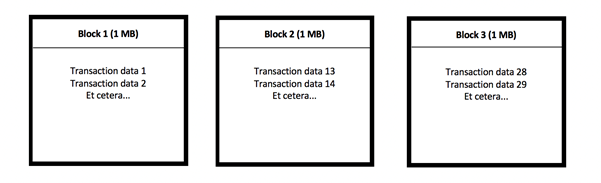

In 2017 the spirit of [Bitcoin](https://en.wikipedia.org/wiki/Bitcoin) really got out of the bottle. After years of silence, Bitcoin’s valuation suddenly rapidly rose from about $1,000 to almost $20,000\. A lot of people reinvented themselves as ‘professional crypto-trader’.

Yes, there was a lot of money to be made for a short period of time. But let’s face it; that party is over now.

Biticoin price chart since October 2013 from [Coinmarketcap.com](https://coinmarketcap.com/).

Still, fact is that even though it was mostly the money that got people’s adrenaline pumping, it is the technology that got the ball rolling in the first place. And this technology, **blockchain**, still holds huge potential. Now could be the time for business developers, entrepreneurs and curious individuals to jump on the blockchain train and to be inspired. But such inspiration will require a better understanding of how the technology works first. Unfortunately, most of the current explanations out there are either covered in complex technical jargon or are way too shallow and lack in-depth details, neither of them which leads to a clear understanding. So where to start? Allow me to suggest you to start here. This ten minute read will explain what is considered so revolutionary about this technology. It will be well worth your time. Enjoy reading.

* * *

# Introduction

First of all; a blockchain is a digital concept to store **data**. This data comes in blocks, so imagine blocks of digital data. These blocks are chained together, and this makes their data immutable. When a block of data is chained to the other blocks, its data can never be changed again. It will be publicly available to anyone who wants to see it ever again, in exactly the way it was once added to the blockchain. That is quite revolutionary, because it allows us to keep track records of pretty much anything we can think of (to name some: property rights, identities, money balances, medical records), without being at risk of someone tampering with those records. If I buy a house right now and add a photo of the property rights to a blockchain, I will always and forever be able to prove that I owned those rights at that point. Nobody can change that piece of information once it is on a blockchain (well, there is *one* way, but this is advanced material so I suggest you read it later, you can find it [here](https://medium.com/coinmonks/what-is-a-51-attack-or-double-spend-attack-aa108db63474) though). So — Blockchain is a way to save data and make it immutable. That sounds great, but the big question of course is: how does that work?

## **Step 1 — Transaction data**

Alright, let’s start off with an example: the Bitcoin blockchain. The Bitcoin blockchain is the oldest blockchain in existence. The blocks on the Bitcoin blockchain consist of approximately 1 MB of data each. At the time of writing it counts about 525,000 blocks, meaning roughly a total of 525,000 MB has been stored on this blockchain. The data on the Bitcoin blockchain exclusively exists out of *transaction data* in regard to *Bitcoin transactions*. It is a giant track record of all the Bitcoin transactions that have ever occurred, all the way back to the very first Bitcoin transaction. In this article we will assume that a blockchain stores *transaction data*, just like the Bitcoin blockchain.

## **Step 2 — Chaining the blocks (with a hash)**

Imagine a bunch of blocks of transaction data (image 1).

Three blocks, all containing some transaction data. Not quite special yet. You can compare it to some stand-alone word documents that simply describe what transactions have occurred and how these have impacted certain balances. Document 1 would then chronologically describe the first transactions that have occurred up to 1 MB, whereafter the next transactions would be described in document 2 up to another MB, and so on. These documents are the blocks of data. These blocks are now being *linked* (aka chained) together. To do this, every block gets a unique (digital) signature that corresponds to exactly the string of data in that block. If anything inside a block changes, even just a single digit change, the block will get a new signature. How this works? This happens through *hashing* and will be thoroughly explained later in step 3.

Let’s say block 1 registers two transactions, transaction 1 and transaction 2\. Imagine that these transactions make up a total of 1 MB (in reality this would be much more transactions). This block of data now gets a signature for this specific string of data. Let’s say the signature is ‘X32’. Here is what this looks like:

Remember, a single digit change to the data in block 1 would now cause it to get a completely *different* signature! The data in block 1 is now linked to block 2 by adding the signature of block 1 to the *data* of block 2\. The signature of block 2 is now partially based on the signature of block 1, because it is included in the string of data in block 2\. Here is what this looks like:

The signatures link the blocks to each other, making them a chain of blocks. Let’s picture adding another block to this chain of blocks; block 3\. Here is what this looks like:

Now imagine if the data in block 1 is *altered*. Let’s say that the transaction between Damian and George is altered and Damian now supposedly sent 500 Bitcoin to George instead of 100 Bitcoin. The string of data in block 1 is now different, meaning the block also gets a new signature. The signature that corresponds with this new set of data is no longer X32\. Let’s say it is now ‘W10’ instead. Here is what happens now:

(visit [**r/BlockchainSchool**](https://www.reddit.com/r/BlockchainSchool/) for more easy to understand blockchain explanations)

The signature W10 does not match the signature that was previously added to block 2 anymore. Block 1 and 2 are now considered no longer chained to each other. This indicates to other users of this blockchain that some data in block 1 was altered, and because the blockchain should be immutable, they reject this change by shifting back to their previous record of the blockchain where all the blocks are still chained together (the record where Damian sent 100 BTC to George). The only way that an alteration can stay undetected, is if all the blocks stay chained to each other. This means for the alteration to go undetected, the new signature of block 1 must replace the old one in the data of block 2\. But if the data of block 2 changes, this will cause block 2 to have a different signature as well. Let’s say the signature of block 2 is now ‘PP4’ instead of 9BZ. Now block 2 and 3 are no longer chained together!

The blocks on a blockchain are publicly available to anyone. So, if an alteration is supposed to stay undetected on a blockchain, all the blocks need to stay properly chained (otherwise people can tell that certain blocks don’t properly link to each other). This means that altering a single block requires a new signature for *every other block that comes after it* all the way to the end of the chain. This is considered to be near impossible. In order to understand why, you will need to understand how the signatures are created.

## **Step 3 — How the signature (hash) is created**

So, let’s picture a block again; block 1\. Block 1 is a record of only one transaction. Thomas sends 100 Bitcoin to David. This specific string of data now requires a signature. In blockchain, this signature is created by a [*cryptographic hash function*](https://simple.wikipedia.org/wiki/Cryptographic_hash_function). A cryptographic hash function is a very complicated formula that takes *any string of input* and turns it into a unique 64-digit string of output. You could for example insert the word ‘Jinglebells’ into [this hash function](https://passwordsgenerator.net/sha256-hash-generator/) (there are other variants of hashing algorithms as well, but we use this one for this example), and you will see that the output for this specific string of data is:

> ***761A7DD9CAFE34C7CDE6C1270E17F773025A61E511A56F700D415F0D3E199868***

If a single digit of the input changes, including a space, changing a capital letter or adding a period for example, the output will be totally different. If you add a period to this word and make it ‘Jinglebells.’ instead, you will see that the output for *this* specific string of data is:

> ***B9B324E2F987CDE8819C051327966DD4071ED72D998E0019981040958FEC291B***

If we now remove the period again, we will get the same output as before:

> ***761A7DD9CAFE34C7CDE6C1270E17F773025A61E511A56F700D415F0D3E199868***

A cryptographic hash function always gives the same output for the same input, but always a different output for different input. This cryptographic hash function is used by the Bitcoin blockchain to give the blocks their signatures. The input of the cryptographic hash function in this case is the data in the block, and the output is the signature that relates to that. Let’s have a look at block 1 again. Thomas sends 100 Bitcoin to David.

Now imagine that the *string of data* from this block looks like this:

Block 1 Thomas -100 David +100

If this string of data is inserted in the hashing algorithm, the output (signature) will be this:

> **BAB5924FC47BBA57F4615230DDBC5675A81AB29E2E0FF85D0C0AD1C1ACA05BFF**

This signature is now added to the data of block 2\. Let’s say that David now transfers 100 Bitcoin to Jimi. The blockchain now looks like this:

The string of data of block 2 now looks like:

*Block 2 David -100 Jimi +100 BAB5924FC47BBA57F4615230DDBC5675A81AB29E2E0FF85D0C0AD1C1ACA05BFF*

If this string of data is inserted in the hashing algorithm, the output (signature) will be this:

> **25D8BE2650D7BC095D3712B14136608E096F060E32CEC7322D22E82EA526A3E5**

And so, this is the signature of block 2\. The cryptographic hash function is used to create the digital signature for each unique block. There is a large variety of hash functions, but the hashing function that is used by the Bitcoin blockchain is the SHA-256 hashing algorithm. But how do the signatures stop someone from simply inserting a new signature for each block after altering one (a change goes undetected if all blocks are properly linked, people won’t be able to tell there was a change)? The answer is that only hashes (signatures) that meet certain requirements are accepted on the blockchain. This is the mining process and is explained in step 4.

## **Step 4 — When does the signature qualify, and who signs a block?**

A signature doesn’t always qualify. A block will *only* be accepted on the blockchain if its digital signature starts with — for example — a consecutive number of *zeroes*. For example; only blocks with a signature starting with at least *ten consecutive zeroes* qualify to be added to the blockchain. However, as explained in chapter 3, every string of data has only *one* unique hash bound to it. What if the signature (hash) of a block doesn’t start with ten zeroes? Well, in order to find the block a signature that meets the requirements, the string of data of a block needs to be changed *repeatedly* until that specific string of data leads to a signature starting with ten zeroes. Because the transaction data and metadata (block number, timestamp, et cetera) need to stay the way they are, a small specific piece of data is added to every block that has no purpose except for being changed repeatedly in order to find an eligible signature. This piece of data is called the *nonce* of a block. The nonce is a completely random string of **numbers** (note: pictures show other digits as well, but a nonce can only be numbers). To summarize what was just explained, a block now contains; 1) transaction data, 2) the signature of the previous block, and 3) a nonce. The process of repeatedly changing the nonce and hashing the block’s data to find an eligible signature is called *mining* and is what *miners* do. Miners spend electricity in the form of computational power by constantly changing the block composition (nonce) and hashing it until they find an eligible signature (output). The more computational power they have, the faster they can hash different block compositions and the more likely they are to find an eligible signature faster. It is a form of *trial and error*. You can picture it like this:

NOTE: Nonce needs to be a number (visit [**r/BlockchainSchool**](https://www.reddit.com/r/BlockchainSchool/) for more easy to understand blockchain explanations)

Any user on a blockchain network can participate in this process by downloading and starting the according *mining software* for that specific blockchain. When a user does this, they will simply put their computational power to work in order to try to solve the nonce for a block. Here is an example of a block of transactions that was recently added to the Bitcoin blockchain, block 521,477:

From [blockchain.com](https://www.blockchain.com/nl/btc/block/0000000000000000000fbb90ac16fce1fa83d6908005548781a91c840fa10f17) (blockchain explorer)

As you can see, the *hash* (signature) of this block and the hash of the previous block both start with a number of zeroes. Finding a hash like that is not easy, it requires a lot of computational power and time, or a lot of *luck*. Yes, it sometimes occurs that a miner gets incredibly lucky and finds a matching signature with very little computational power in a matter of minutes. An extremely rare example recently occurred on block 523,034\. A very small miner with only very little computational power found an eligible signature real fast, while all other miners combined had *7 trillion times* as much computational power. In comparison, the chances of winning the powerball lottery jackpot are one in *292* *million*, meaning it is 24,000 times easier to win the powerball lottery jackpot than it was for this miner to win the competition versus the rest of the network. Talk about a number of zeroes. Anyway, important to understand from this chapter is that finding an eligible signature is *hard*.

## **Step 5 — How does this make the blockchain immutable?**

As discussed previously in step 3, altering a block will unchain it from the subsequent blocks. In order for an altered block to be accepted by the rest of the network, it needs to be chained to the subsequent blocks again. See where this is going? It was previously explained that this requires every block that comes after it to get a new signature. And that signature needs to meet the requirements! Giving *all of these blocks* a new signature will be *very costly and time-consuming,* although it doesn’t seem impossible. It *is* considered impossible anyway though, and here is why:

Let’s say a *corrupt* miner has altered a block of transactions and is now trying to calculate new signatures for the subsequent blocks in order to have the rest of the network accept his change. The problem for him is, the rest of the network is also calculating new signatures for new blocks. The corrupt miner will have to calculate new signatures for these blocks too as they are being added to the end of the chain. After all, he needs to keep **all of the blocks** linked, including the new ones constantly being added. Unless the miner has more computational power than the rest of the network combined, he will never catch up with the rest of the network finding signatures.

(visit [**r/BlockchainSchool**](https://www.reddit.com/r/BlockchainSchool/) for more easy to understand blockchain explanations)

Millions of users are mining on the Bitcoin blockchain, and therefore it can be assumed that a single bad actor or entity on the network will never have more computational power than the rest of the network combined, meaning the network will never accept any changes on the blockchain, making the blockchain **immutable**. Once data has been added to the blockchain, it can never be changed again. There is an exception though. What if a bad actor *has* more computational power than the rest of the network combined? Theoretically yes, this is possible. It is called *a 51% attack* ([I wrote an article about it here)](https://medium.com/coinmonks/what-is-a-51-attack-or-double-spend-attack-aa108db63474) and has occurred on various blockchains in the past. In reality though, a 51% attack on the Bitcoin blockchain would be far more costly to execute than it would yield in return. It would not just require an immense amount of hardware, cooling equipment and storage space for the computational power, but also involves the risk of prosecution and, more importantly, would dramatically harm the ecosystem of the according blockchain itself, rendering the potential returns in Bitcoin to drop significantly in value. Attempting a 51% attack is practically trying to fight all the other users on a blockchain just by yourself. This is also the reason that the more users participate in the mining process, the more secure a blockchain becomes. Congrats on still being here! Hopefully, you now understand why a (large) blockchain is considered immutable. An important question arises now though. How are miners stopped from adding corrupt data to the blockchain (like falsified transaction data)? That is technically impossible, more details about transactions on the blockchain in [this article here](https://medium.com/coinmonks/how-a-miner-adds-transactions-to-the-blockchain-in-seven-steps-856053271476).

## **Step 6 — How is the blockchain governed? Who determines the rules?**

The Bitcoin blockchain follows a governance model of democracy, and therefore updates its’ record of transactions (and thus the Bitcoin balances) according to what the *majority of its’ users* say is the truth. The blockchain protocol does this automatically by always following the record of the longest blockchain** **that it has, because it assumes that this chain is represented by the majority. After all, it requires the *majority of the computational power to create the longest version of the blockchain.* This is also how an altered block is automatically rejected by the majority of the network. The majority of the network rejects an altered block automatically because it is no longer chained to the longest chain.

On the Bitcoin blockchain, all transaction history and wallet balances are public ([blockchain.info](https://blockchain.info/)). Anyone can look up any wallet or transaction that has ever occurred all the way back to the first transaction that was ever made (on January 3rd, 2009). Although wallet balances can be checked by anyone publicly, the owners of those wallets remain largely unknown. [Here is an example of a wallet still containing 69,000 Bitcoin, at the time of writing worth about roughly 500 million dollars](https://bitinfocharts.com/bitcoin/address/1HQ3Go3ggs8pFnXuHVHRytPCq5fGG8Hbhx). It was last used in April 2015, only to show no activity ever since.

## **Final step, step 7 — Where does this leave cryptocurrencies?**

Cryptocurrencies are basically an altered form of Bitcoin. Most cryptocurrencies are built upon their own blockchain protocol that may have different rules from the Bitcoin blockchain. Bitcoin is supposed to be a **currency**, meaning it is explicitly supposed to function as money. Monero is a cryptocurrency with the same function, but its blockchain protocol has implemented some extra rules that make it a more private currency (transactions are much harder to trace). Cryptocurrencies can however be given any kind of value, depending on their issuer. They could be referred to as ‘tokens’. These tokens can give the owners the right to ‘something’, varying from a gaming license or access to social media to downright electricity or water, you name it. Any sort of value can be attached to a ‘cryptocurrency’ token. All these cryptocurrency transactions are registered on various blockchains and can be exchanged online through cryptocurrency exchanges such as [Binance](https://www.binance.com/?ref=11731705). It is the new money of the internet. A good example of an industry that might be affected is the stock market industry. There is a good chance that company shares and other property rights will be registered as tokens on a blockchain in the future. But blockchains are not just limited to registering materialistic value in the form of tokens. Blockchains also have the potential to safely register data in the form of medical records, identities, history records, tax records and much, much more. This is why the technology is so huge, and I haven’t even mentioned decentralization yet (another big aspect of blockchain).

Interested in more? Follow-up articles are right below.

* * *

Was this article helpful? Then please consider to help others find this by applauding or sharing. For more clear and easy to understand blockchain basics you can read my other articles about..

## Beginner 2: [How mining works and how transactions are processed](https://medium.com/coinmonks/how-a-miner-adds-transactions-to-the-blockchain-in-seven-steps-856053271476)

## Beginner 3: [How a hacker performs a 51% attack](https://medium.com/coinmonks/what-is-a-51-attack-or-double-spend-attack-aa108db63474)

## Beginner 4: [Nodes and masternodes](https://medium.com/coinmonks/blockchain-what-is-a-node-or-masternode-and-what-does-it-do-4d9a4200938f)

## Beginner 5: [Mining difficulty and block time](https://blog.goodaudience.com/blockchain-the-mystery-of-mining-difficulty-and-block-time-f07f0ee64fd0)

## [Blockchain Terminology: Basic terminology to get you started](https://medium.com/@JimiS/blockchain-terminology-d903758d6bd)

原文链接：
https://blog.goodaudience.com/blockchain-for-beginners-what-is-blockchain-519db8c6677a

