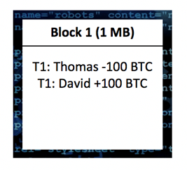

In 2017 the spirit of [Bitcoin](https://en.wikipedia.org/wiki/Bitcoin) really got out of the bottle. After years of silence, Bitcoin’s valuation suddenly rapidly rose from about $1,000 to almost $20,000\. A lot of people reinvented themselves as ‘professional crypto-trader’.
2017年，[比特币]（https：//en.wikipedia.org/wiki/比特币）的精神真正走出了瓶子。经过多年的沉默，比特币的估值突然从1000美元左右迅速上升到近20，000美元*。很多人把自己重新塑造成"专业加密交易者"。

Yes, there was a lot of money to be made for a short period of time. But let’s face it; that party is over now.
是的，有很多钱可以在短时间内赚。但是，让我们面对它;那个聚会现在结束了。

Biticoin price chart since October 2013 from [Coinmarketcap.com](https://coinmarketcap.com/).
比蒂币价格图表自2013年10月以来从[Coinmarketcap.com](https://coinmarketcap.com/).

Still, fact is that even though it was mostly the money that got people’s adrenaline pumping, it is the technology that got the ball rolling in the first place. And this technology, **blockchain**, still holds huge potential. Now could be the time for business developers, entrepreneurs and curious individuals to jump on the blockchain train and to be inspired. But such inspiration will require a better understanding of how the technology works first. Unfortunately, most of the current explanations out there are either covered in complex technical jargon or are way too shallow and lack in-depth details, neither of them which leads to a clear understanding. So where to start? Allow me to suggest you to start here. This ten minute read will explain what is considered so revolutionary about this technology. It will be well worth your time. Enjoy reading.
然而，事实是，即使它大多是钱，让人们的肾上腺素泵，这是技术，使球滚动摆在首位。而这项技术，[区块链]，仍然拥有巨大的潜力。现在可能是商业开发人员、企业家和好奇的个人跳上区块链列车并受到启发的时候了。但是，这种灵感需要更好地了解技术首先是如何工作的。不幸的是，目前大多数的解释要么被复杂的技术术语所涵盖，要么过于肤浅，缺乏深入的细节，这两种解释都没有导致明确的理解。那么从哪里开始呢？请允许我建议你从这里开始。这十分钟的阅读将解释什么被认为是如此革命的技术。这将是非常值得你的时间。享受阅读。

* * *

# Introduction
• 简介
First of all; a blockchain is a digital concept to store **data**. This data comes in blocks, so imagine blocks of digital data. These blocks are chained together, and this makes their data immutable. When a block of data is chained to the other blocks, its data can never be changed again. It will be publicly available to anyone who wants to see it ever again, in exactly the way it was once added to the blockchain. That is quite revolutionary, because it allows us to keep track records of pretty much anything we can think of (to name some: property rights, identities, money balances, medical records), without being at risk of someone tampering with those records. If I buy a house right now and add a photo of the property rights to a blockchain, I will always and forever be able to prove that I owned those rights at that point. Nobody can change that piece of information once it is on a blockchain (well, there is *one* way, but this is advanced material so I suggest you read it later, you can find it [here](https://medium.com/coinmonks/what-is-a-51-attack-or-double-spend-attack-aa108db63474) though). So — Blockchain is a way to save data and make it immutable. That sounds great, but the big question of course is: how does that work?
首先，我们区块链是一个存储[数据]的数字概念。这些数据有块，所以想象数字数据块。这些块被链接在一起，这使得它们的数据是不可变的。当数据块被链接到其他数据块时，其数据再也不能更改。它将公开提供给任何想要再次看到它的人，其方式与它曾经添加到区块链时完全一样。这是相当革命性的，因为它允许我们记录几乎任何我们可以想到的记录（举一些：产权，身份，资金余额，医疗记录），而不会有人篡改这些记录的风险。如果我现在买房子，并添加一张产权的照片到区块链，我将永远和永远能够证明我拥有这些权利在这一点上。一旦信息在区块链上，没有人可以改变它（嗯，有[一个]方式，但这是高级材料，所以我建议你稍后阅读它，你可以找到它[在这里]（https：//media.com/硬币僧侣/什么是-51攻击或双重支出攻击-aa108db63474）虽然）。因此，区块链是一种保存数据并使数据不可变的方法。这听起来不错，但最大的问题是：这是如何工作的？

## **Step 1 — Transaction data**
[ 步骤 1 ] 事务数据]
Alright, let’s start off with an example: the Bitcoin blockchain. The Bitcoin blockchain is the oldest blockchain in existence. The blocks on the Bitcoin blockchain consist of approximately 1 MB of data each. At the time of writing it counts about 525,000 blocks, meaning roughly a total of 525,000 MB has been stored on this blockchain. The data on the Bitcoin blockchain exclusively exists out of *transaction data* in regard to *Bitcoin transactions*. It is a giant track record of all the Bitcoin transactions that have ever occurred, all the way back to the very first Bitcoin transaction. In this article we will assume that a blockchain stores *transaction data*, just like the Bitcoin blockchain.
好吧，让我们从一个例子开始：比特币区块链。比特币区块链是现存最古老的区块链。比特币区块链上的块由大约1MB的数据组成。在撰写本文时，它计数约 525，000 个块，这意味着此区块链上总共存储了 525，000 MB。比特币区块链上的数据完全存在于[交易数据]中[比特币交易]。这是所有比特币交易的巨大记录，一直追溯到第一次比特币交易。在本文中，我们将假设区块链存储 [交易数据]，就像比特币区块链一样。

## **Step 2 — Chaining the blocks (with a hash)**

Imagine a bunch of blocks of transaction data (image 1).
[ 步骤 2 ] 链接块（使用哈希） ]

Three blocks, all containing some transaction data. Not quite special yet. You can compare it to some stand-alone word documents that simply describe what transactions have occurred and how these have impacted certain balances. Document 1 would then chronologically describe the first transactions that have occurred up to 1 MB, whereafter the next transactions would be described in document 2 up to another MB, and so on. These documents are the blocks of data. These blocks are now being *linked* (aka chained) together. To do this, every block gets a unique (digital) signature that corresponds to exactly the string of data in that block. If anything inside a block changes, even just a single digit change, the block will get a new signature. How this works? This happens through *hashing* and will be thoroughly explained later in step 3.
三个块，全部包含一些事务数据。还不太特别。您可以将它与一些独立的单词文档进行比较，这些文档仅描述发生了哪些事务以及这些事务如何影响某些余额。然后，文档 1 按时间顺序描述发生的第一个事务最多 1 MB，然后下一个事务将在文档 2 中描述的另一 MB 中，等等。这些文档是数据块。这些方块现在被[链接]（又名链接）在一起。为此，每个块都会获得一个唯一（数字）签名，该签名正好对应于该块中的数据字符串。如果块内的任何内容发生更改，即使只有一位数字更改，该块也会获得新签名。这是如何工作的？这通过 [哈希] 进行，将在步骤 3 的后面得到详细解释。

Let’s say block 1 registers two transactions, transaction 1 and transaction 2\. Imagine that these transactions make up a total of 1 MB (in reality this would be much more transactions). This block of data now gets a signature for this specific string of data. Let’s say the signature is ‘X32’. Here is what this looks like:
假设块 1 注册两个事务，事务 1 和事务 2*。假设这些事务总共占 1 MB（实际上，这将会是更多的事务）。此数据块现在获取此特定数据字符串的签名。假设签名是"X32"。如下所示：

Remember, a single digit change to the data in block 1 would now cause it to get a completely *different* signature! The data in block 1 is now linked to block 2 by adding the signature of block 1 to the *data* of block 2\. The signature of block 2 is now partially based on the signature of block 1, because it is included in the string of data in block 2\. Here is what this looks like:
请记住，对块 1 中的数据进行一位数字更改现在会导致它获得一个完全不同的签名！块 1 中的数据现在通过将块 1 的签名添加到块 2 的 [data] 中链接到块 2。块 2 的签名现在部分基于块 1 的签名，因为它包含在块 2*中的数据字符串中。如下所示：

The signatures link the blocks to each other, making them a chain of blocks. Let’s picture adding another block to this chain of blocks; block 3\. Here is what this looks like:
签名将块相互链接，使它们成为块链。让我们图片添加另一个块到这个块链;块 3*。如下所示：

Now imagine if the data in block 1 is *altered*. Let’s say that the transaction between Damian and George is altered and Damian now supposedly sent 500 Bitcoin to George instead of 100 Bitcoin. The string of data in block 1 is now different, meaning the block also gets a new signature. The signature that corresponds with this new set of data is no longer X32\. Let’s say it is now ‘W10’ instead. Here is what happens now:
现在想象一下，如果块 1 中的数据是 [更改]的。假设达米安和乔治之间的交易被改变，达米安现在据说向乔治发送了500比特币，而不是100比特币。块 1 中的数据字符串现在不同，这意味着块也会获得一个新的签名。与此新数据集对应的签名不再是 X32*。假设现在是"W10"。以下是现在发生的情况：

(visit [**r/BlockchainSchool**](https://www.reddit.com/r/BlockchainSchool/) for more easy to understand blockchain explanations)
（访问 [r/区块链学校]（https：//www.reddit.com/r/区块链学校/），了解更容易理解的区块链解释）

The signature W10 does not match the signature that was previously added to block 2 anymore. Block 1 and 2 are now considered no longer chained to each other. This indicates to other users of this blockchain that some data in block 1 was altered, and because the blockchain should be immutable, they reject this change by shifting back to their previous record of the blockchain where all the blocks are still chained together (the record where Damian sent 100 BTC to George). The only way that an alteration can stay undetected, is if all the blocks stay chained to each other. This means for the alteration to go undetected, the new signature of block 1 must replace the old one in the data of block 2\. But if the data of block 2 changes, this will cause block 2 to have a different signature as well. Let’s say the signature of block 2 is now ‘PP4’ instead of 9BZ. Now block 2 and 3 are no longer chained together!
签名 W10 与以前添加到块 2 中的签名不再匹配。块 1 和 2 现在被视为不再相互链接。这向该区块链的其他用户表明，块 1 中的一些数据被更改，并且由于区块链应该是不可变的，因此他们拒绝此更改，将其移回其以前的区块链记录，其中所有块仍链接在一起（记录，达米安发送100 BTC乔治）。改变可以不被发现的唯一方法是，如果所有的方块都彼此保持链接。这意味着要未检测到更改，块 1 的新签名必须替换块 2*数据中的旧签名。但是，如果块 2 的数据发生更改，这将导致块 2 也具有不同的签名。假设块 2 的签名现在是"PP4"而不是 9BZ。现在，第 2 块和第 3 块不再链接在一起！

The blocks on a blockchain are publicly available to anyone. So, if an alteration is supposed to stay undetected on a blockchain, all the blocks need to stay properly chained (otherwise people can tell that certain blocks don’t properly link to each other). This means that altering a single block requires a new signature for *every other block that comes after it* all the way to the end of the chain. This is considered to be near impossible. In order to understand why, you will need to understand how the signatures are created.

## **Step 3 — How the signature (hash) is created**

So, let’s picture a block again; block 1\. Block 1 is a record of only one transaction. Thomas sends 100 Bitcoin to David. This specific string of data now requires a signature. In blockchain, this signature is created by a [*cryptographic hash function*](https://simple.wikipedia.org/wiki/Cryptographic_hash_function). A cryptographic hash function is a very complicated formula that takes *any string of input* and turns it into a unique 64-digit string of output. You could for example insert the word ‘Jinglebells’ into [this hash function](https://passwordsgenerator.net/sha256-hash-generator/) (there are other variants of hashing algorithms as well, but we use this one for this example), and you will see that the output for this specific string of data is:

> ***761A7DD9CAFE34C7CDE6C1270E17F773025A61E511A56F700D415F0D3E199868***

If a single digit of the input changes, including a space, changing a capital letter or adding a period for example, the output will be totally different. If you add a period to this word and make it ‘Jinglebells.’ instead, you will see that the output for *this* specific string of data is:

> ***B9B324E2F987CDE8819C051327966DD4071ED72D998E0019981040958FEC291B***

If we now remove the period again, we will get the same output as before:

> ***761A7DD9CAFE34C7CDE6C1270E17F773025A61E511A56F700D415F0D3E199868***

A cryptographic hash function always gives the same output for the same input, but always a different output for different input. This cryptographic hash function is used by the Bitcoin blockchain to give the blocks their signatures. The input of the cryptographic hash function in this case is the data in the block, and the output is the signature that relates to that. Let’s have a look at block 1 again. Thomas sends 100 Bitcoin to David.
加密哈希函数始终为同一输入提供相同的输出，但始终为不同的输入提供不同的输出。比特币区块链使用此加密哈希函数为模块提供其签名。在这种情况下，加密哈希函数的输入是块中的数据，输出是与此相关的签名。让我们再看一下块 1。托马斯向大卫发送100比特币。

Now imagine that the *string of data* from this block looks like this:
现在想象一下，来自此块的 [数据字符串] 如下所示：
Block 1 Thomas -100 David +100

If this string of data is inserted in the hashing algorithm, the output (signature) will be this:
如果此数据字符串插入哈希算法中，则输出（签名）将为：
> **BAB5924FC47BBA57F4615230DDBC5675A81AB29E2E0FF85D0C0AD1C1ACA05BFF**

This signature is now added to the data of block 2\. Let’s say that David now transfers 100 Bitcoin to Jimi. The blockchain now looks like this:
此签名现在添加到块 2*的数据中。假设大卫现在将100比特币转移到吉米。区块链现在如下所示：

The string of data of block 2 now looks like:
块 2 的数据字符串现在如下所示：
*Block 2 David -100 Jimi +100 BAB5924FC47BBA57F4615230DDBC5675A81AB29E2E0FF85D0C0AD1C1ACA05BFF*

If this string of data is inserted in the hashing algorithm, the output (signature) will be this:
如果此数据字符串插入哈希算法中，则输出（签名）将为：
> **25D8BE2650D7BC095D3712B14136608E096F060E32CEC7322D22E82EA526A3E5**

And so, this is the signature of block 2\. The cryptographic hash function is used to create the digital signature for each unique block. There is a large variety of hash functions, but the hashing function that is used by the Bitcoin blockchain is the SHA-256 hashing algorithm. But how do the signatures stop someone from simply inserting a new signature for each block after altering one (a change goes undetected if all blocks are properly linked, people won’t be able to tell there was a change)? The answer is that only hashes (signatures) that meet certain requirements are accepted on the blockchain. This is the mining process and is explained in step 4.
因此，这是块 2*的签名。加密哈希函数用于为每个唯一块创建数字签名。有大量的哈希函数，但比特币区块链使用的哈希函数是SHA-256哈希算法。但是，签名如何阻止某人在更改一个块后简单地为每个块插入一个新签名（如果所有块都正确链接，人们将无法判断有更改，则更改不会被发现）？答案是，区块链上只接受满足某些要求的哈希（签名）。这是挖掘过程，在步骤 4 中进行了说明。
## **Step 4 — When does the signature qualify, and who signs a block?**
[ 步骤 4 ] 签名何时符合条件，以及谁签名块？
A signature doesn’t always qualify. A block will *only* be accepted on the blockchain if its digital signature starts with — for example — a consecutive number of *zeroes*. For example; only blocks with a signature starting with at least *ten consecutive zeroes* qualify to be added to the blockchain. However, as explained in chapter 3, every string of data has only *one* unique hash bound to it. What if the signature (hash) of a block doesn’t start with ten zeroes? Well, in order to find the block a signature that meets the requirements, the string of data of a block needs to be changed *repeatedly* until that specific string of data leads to a signature starting with ten zeroes. Because the transaction data and metadata (block number, timestamp, et cetera) need to stay the way they are, a small specific piece of data is added to every block that has no purpose except for being changed repeatedly in order to find an eligible signature. This piece of data is called the *nonce* of a block. The nonce is a completely random string of **numbers** (note: pictures show other digits as well, but a nonce can only be numbers). To summarize what was just explained, a block now contains; 1) transaction data, 2) the signature of the previous block, and 3) a nonce. The process of repeatedly changing the nonce and hashing the block’s data to find an eligible signature is called *mining* and is what *miners* do. Miners spend electricity in the form of computational power by constantly changing the block composition (nonce) and hashing it until they find an eligible signature (output). The more computational power they have, the faster they can hash different block compositions and the more likely they are to find an eligible signature faster. It is a form of *trial and error*. You can picture it like this:
签名并不总是符合条件。如果区块链上的块的数字签名以 [例如] 连续数的 [零] 开头，则该块将被区块链上接受。例如：只有签名以至少 [十个连续零] 开头的块才有资格添加到区块链中。但是，如第 3 章所述，每个数据字符串都只有 [一个] 唯一的哈希绑定到它。如果块的签名（哈希）不以 10 个零开头，该怎么办？那么，为了找到符合要求的签名块，需要[重复]更改块的数据字符串，直到该特定的数据字符串导致从 10 个零开始的签名。由于事务数据和元数据（块号、时间戳等）需要保持原样，因此，除了为了查找符合条件的签名而重复更改之外，向每个块中添加一小块特定数据。此数据段称为块的 [nonce]。nonce 是一个完全随机的 [数字] 字符串（注意：图片还显示其他数字，但 nonce 只能是数字）。总结刚才解释的内容，现在包含一个块;1） 事务数据，2） 前一个块的签名，以及 3） nonce。反复更改 nonce 并哈希块的数据以查找符合条件的签名的过程称为 [挖掘] ，这就是 [矿工] 所做的。矿工通过不断改变块组成（nonce）并哈希，直到找到合格的签名（输出），以计算能力的形式花费电力。计算能力越强，它们对不同的块组成进行哈希化的速度就越快，并且越有可能更快地找到符合条件的签名。它是[试验和错误]的一种形式。你可以这样想象：

NOTE: Nonce needs to be a number (visit [**r/BlockchainSchool**](https://www.reddit.com/r/BlockchainSchool/) for more easy to understand blockchain explanations)
注： Nonce 需要是一个数字 （访问 [r/区块链学校]（https：//www.reddit.com/r/区块链学校/），以便更容易理解区块链解释）

Any user on a blockchain network can participate in this process by downloading and starting the according *mining software* for that specific blockchain. When a user does this, they will simply put their computational power to work in order to try to solve the nonce for a block. Here is an example of a block of transactions that was recently added to the Bitcoin blockchain, block 521,477:
区块链网络上的任何用户都可以通过下载并启动该特定区块链的 [挖掘软件] 来参与此过程。当用户这样做时，他们只需将其计算能力用于工作，以尝试解决块的 nonce 问题。下面是最近添加到比特币区块链的一个交易块的示例，块 521，477：

From [blockchain.com](https://www.blockchain.com/nl/btc/block/0000000000000000000fbb90ac16fce1fa83d6908005548781a91c840fa10f17) (blockchain explorer)
从 [区块链.com] （https：//www.blockchain.com/nl/btc/block/block/00000000000000000000000000fb90ac16fce1fa83d6908005548781aa91c840fa10f17）

As you can see, the *hash* (signature) of this block and the hash of the previous block both start with a number of zeroes. Finding a hash like that is not easy, it requires a lot of computational power and time, or a lot of *luck*. Yes, it sometimes occurs that a miner gets incredibly lucky and finds a matching signature with very little computational power in a matter of minutes. An extremely rare example recently occurred on block 523,034\. A very small miner with only very little computational power found an eligible signature real fast, while all other miners combined had *7 trillion times* as much computational power. In comparison, the chances of winning the powerball lottery jackpot are one in *292* *million*, meaning it is 24,000 times easier to win the powerball lottery jackpot than it was for this miner to win the competition versus the rest of the network. Talk about a number of zeroes. Anyway, important to understand from this chapter is that finding an eligible signature is *hard*.
如您所见，此块的 [哈希] （签名）和前一个块的哈希都以多个零开头。找到这样的哈希是不容易的，它需要大量的计算能力和时间，或者很多[运气]。是的，有时矿工会非常幸运，在几分钟内找到一个计算能力极小的匹配签名。最近，在块 523，034*上发生了一个极为罕见的示例。一个只有很少计算能力的非常小的矿工很快找到了一个合格的签名，而所有其他矿工加起来的计算能力是[7万亿倍]。相比之下，赢得强力球彩票头奖的几率是[292][百万]，这意味着赢得强力球彩票头奖的几率是这个矿工赢得与网络其他部分竞争的24，000倍。谈论一些零。无论如何，从本章中了解的重要一点就是找到符合条件的签名是[很难]的。
## **Step 5 — How does this make the blockchain immutable?**
[ 步骤 5 ] 如何使区块链不可变？
As discussed previously in step 3, altering a block will unchain it from the subsequent blocks. In order for an altered block to be accepted by the rest of the network, it needs to be chained to the subsequent blocks again. See where this is going? It was previously explained that this requires every block that comes after it to get a new signature. And that signature needs to meet the requirements! Giving *all of these blocks* a new signature will be *very costly and time-consuming,* although it doesn’t seem impossible. It *is* considered impossible anyway though, and here is why:
如步骤 3 中前面所述，更改块将取消将其与后续块的链条。为了使更改后的块被网络的其余部分接受，需要再次将其链接到后续块。看到这是怎么回事吗？之前有人解释说，这需要它之后的每个块才能得到新的签名。并且该签名需要满足要求！给[所有这些块]一个新的签名将是[非常昂贵和费时]，尽管这看起来并不是不可能的。不管怎样，它被认为是不可能的，原因如下：
Let’s say a *corrupt* miner has altered a block of transactions and is now trying to calculate new signatures for the subsequent blocks in order to have the rest of the network accept his change. The problem for him is, the rest of the network is also calculating new signatures for new blocks. The corrupt miner will have to calculate new signatures for these blocks too as they are being added to the end of the chain. After all, he needs to keep **all of the blocks** linked, including the new ones constantly being added. Unless the miner has more computational power than the rest of the network combined, he will never catch up with the rest of the network finding signatures.
假设一个[腐败]矿工已经改变了一个交易块，现在试图计算后续块的新签名，以便让网络的其余部分接受他的更改。他面临的问题是，网络的其余部分也在计算新块的新签名。腐败的矿工将不得不计算这些块的新签名，因为它们被添加到链的末尾。毕竟，他需要保持[所有方块]链接，包括不断添加新的方块。除非矿工的计算能力超过网络其他部分的总和，否则他永远不会赶上网络的其他部分寻找签名。

(visit [**r/BlockchainSchool**](https://www.reddit.com/r/BlockchainSchool/) for more easy to understand blockchain explanations)
（访问 [r/区块链学校]（https：//www.reddit.com/r/区块链学校/），了解更容易理解的区块链解释）

Millions of users are mining on the Bitcoin blockchain, and therefore it can be assumed that a single bad actor or entity on the network will never have more computational power than the rest of the network combined, meaning the network will never accept any changes on the blockchain, making the blockchain **immutable**. Once data has been added to the blockchain, it can never be changed again. There is an exception though. What if a bad actor *has* more computational power than the rest of the network combined? Theoretically yes, this is possible. It is called *a 51% attack* ([I wrote an article about it here)](https://medium.com/coinmonks/what-is-a-51-attack-or-double-spend-attack-aa108db63474) and has occurred on various blockchains in the past. In reality though, a 51% attack on the Bitcoin blockchain would be far more costly to execute than it would yield in return. It would not just require an immense amount of hardware, cooling equipment and storage space for the computational power, but also involves the risk of prosecution and, more importantly, would dramatically harm the ecosystem of the according blockchain itself, rendering the potential returns in Bitcoin to drop significantly in value. Attempting a 51% attack is practically trying to fight all the other users on a blockchain just by yourself. This is also the reason that the more users participate in the mining process, the more secure a blockchain becomes. Congrats on still being here! Hopefully, you now understand why a (large) blockchain is considered immutable. An important question arises now though. How are miners stopped from adding corrupt data to the blockchain (like falsified transaction data)? That is technically impossible, more details about transactions on the blockchain in [this article here](https://medium.com/coinmonks/how-a-miner-adds-transactions-to-the-blockchain-in-seven-steps-856053271476).
数百万用户正在比特币区块链上挖掘，因此可以假定网络上的单个坏参与者或实体永远不会拥有比网络其他部分加起来更多的计算能力，这意味着网络永远不会接受任何更改。区块链，使区块链[不可改变]。一旦数据被添加到区块链，它就再也无法更改。但有一个例外。如果一个坏的演员的计算能力比网络其他参与者加起来还要多，那该怎么办？理论上是的，这是可能的。它被称为[51%的攻击]（[我在这里写了一篇文章）]（https：//media.com/coinmonks/什么是-a-51攻击或双重支出攻击-aa108db63474），并且在过去发生过在各种区块链上。然而，在现实中，对比特币区块链进行51%的攻击，执行成本将远远高于它的回报。它不仅需要大量的硬件、冷却设备和存储空间来计算能力，而且还涉及起诉的风险，更重要的是，将极大地损害基于区块链本身的生态系统，使比特币的潜在回报在价值上大幅下降。尝试 51% 的攻击实际上是试图自己对抗区块链上的所有其他用户。这也是用户参与挖掘过程越多的原因，区块链就越安全。恭喜你还能在这里！希望您现在能够理解为什么（大型）区块链被认为是不可变的。然而，现在出现了一个重要的问题。矿工如何阻止向区块链添加腐败数据（如伪造的交易数据）？这在技术上是不可能的，关于区块链上交易的更多详细信息，本文[本文]（https：//media.com/coinmonks/如何-一个矿工-添加交易-区块链-七步-856053271476）。
## **Step 6 — How is the blockchain governed? Who determines the rules?**
[ 步骤 6 ] 区块链是如何治理的？谁决定规则？
The Bitcoin blockchain follows a governance model of democracy, and therefore updates its’ record of transactions (and thus the Bitcoin balances) according to what the *majority of its’ users* say is the truth. The blockchain protocol does this automatically by always following the record of the longest blockchain** **that it has, because it assumes that this chain is represented by the majority. After all, it requires the *majority of the computational power to create the longest version of the blockchain.* This is also how an altered block is automatically rejected by the majority of the network. The majority of the network rejects an altered block automatically because it is no longer chained to the longest chain.
比特币区块链遵循民主的治理模式，因此根据[大多数用户]所说的事实，更新其交易记录（以及比特币余额）。区块链协议通过始终遵循最长的区块链记录自动实现此功能，因为它假定此链由多数代表。毕竟，它需要[大部分计算能力]来创建区块链最长的版本。大多数网络会自动拒绝更改的块，因为它不再链接到最长的链。
On the Bitcoin blockchain, all transaction history and wallet balances are public ([blockchain.info](https://blockchain.info/)). Anyone can look up any wallet or transaction that has ever occurred all the way back to the first transaction that was ever made (on January 3rd, 2009). Although wallet balances can be checked by anyone publicly, the owners of those wallets remain largely unknown. [Here is an example of a wallet still containing 69,000 Bitcoin, at the time of writing worth about roughly 500 million dollars](https://bitinfocharts.com/bitcoin/address/1HQ3Go3ggs8pFnXuHVHRytPCq5fGG8Hbhx). It was last used in April 2015, only to show no activity ever since.
在比特币区块链上，所有交易历史和钱包余额都是公开的（[区块链.info]（https：//区块链.info/）。）。任何人都可以查找任何钱包或交易，曾经发生过，回到有史以来的第一个交易（2009年1月3日）。虽然钱包余额可以由任何人公开检查，但这些钱包的所有者基本上仍然未知。[下面是一个钱包的例子，钱包上仍然包含 69，000 比特币，在撰写本文时价值约 5 亿美元]（https://bitinfocharts.com/bitcoin/address/1HQ3Go3ggs8pFnXuHVHRytPCq5fGG8Hbhx）。它最后一次使用是在 2015 年 4 月，但此后一直没有活动。
## **Final step, step 7 — Where does this leave cryptocurrencies?**
[ 最后一步，步骤 7 ] 加密货币的去向？
Cryptocurrencies are basically an altered form of Bitcoin. Most cryptocurrencies are built upon their own blockchain protocol that may have different rules from the Bitcoin blockchain. Bitcoin is supposed to be a **currency**, meaning it is explicitly supposed to function as money. Monero is a cryptocurrency with the same function, but its blockchain protocol has implemented some extra rules that make it a more private currency (transactions are much harder to trace). Cryptocurrencies can however be given any kind of value, depending on their issuer. They could be referred to as ‘tokens’. These tokens can give the owners the right to ‘something’, varying from a gaming license or access to social media to downright electricity or water, you name it. Any sort of value can be attached to a ‘cryptocurrency’ token. All these cryptocurrency transactions are registered on various blockchains and can be exchanged online through cryptocurrency exchanges such as [Binance](https://www.binance.com/?ref=11731705). It is the new money of the internet. A good example of an industry that might be affected is the stock market industry. There is a good chance that company shares and other property rights will be registered as tokens on a blockchain in the future. But blockchains are not just limited to registering materialistic value in the form of tokens. Blockchains also have the potential to safely register data in the form of medical records, identities, history records, tax records and much, much more. This is why the technology is so huge, and I haven’t even mentioned decentralization yet (another big aspect of blockchain).
加密货币基本上是一种改变的比特币形式。大多数加密货币都构建在他们自己的区块链协议之上，这些协议可能具有与比特币区块链不同的规则。比特币应该是一种"货币"，这意味着它被明确描述为货币。Monero 是具有相同功能的加密货币，但其区块链协议已经实现了一些额外的规则，使其成为一种更私密的货币（交易更难跟踪）。然而，加密货币可以被赋予任何类型的价值，这取决于其发行人。它们可以称为"令牌"。这些代币可以赋予所有者"某物"的权利，从游戏许可证或社交媒体访问到彻头彻尾的电力或水，您都可以命名。任何类型的价值都可以附加到"加密货币"令牌。所有这些加密货币交易都注册在各种区块链上，可以通过加密货币交易所（如[Binance]（https：//www.binance.com/？ref=11731705）进行在线交换。这是互联网的新钱。股票市场行业是一个可能受到影响的行业的一个很好的例子。将来，公司股票和其他产权很有可能在区块链上注册为代币。但是区块链并不仅限于以代币的形式注册物质价值。区块链还有可能以医疗记录、身份、历史记录、税务记录等形式安全地注册数据， 等等。这就是为什么技术如此巨大，我甚至还没有提到分散化（区块链的另一个重要方面）。

