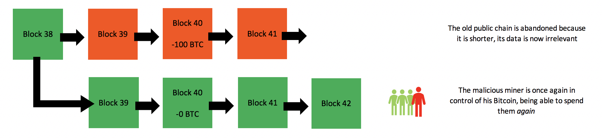

A 51% attack or *double-spend attack* is a miner or group of miners on a blockchain trying to spend their crypto’s on that blockchain **twice**. They try to ‘double spend’ them, hence the name. The goal of this isn’t always to double spend crypto’s, but more often to cast discredit over a certain crypto or blockchain by affecting its integrity.

Here is a brief example: let’s say I spend 10 Bitcoin on a luxurious car. The car gets delivered a few days later, and my Bitcoins are transferred from me to the car company. By performing a 51% attack on the Bitcoin blockchain, I can now try to *reverse* this Bitcoin transfer. If I succeed, I will possess both the luxurious car *and* my Bitcoins, allowing me to spend those Bitcoins again. The concept of a 51% attack may seem obvious in perspective of a democratic blockchain, but there is a common misconception about how it works. This short article will attempt to give a lucid explanation of how a 51% attack works in more detail. If you don’t know how miners add transactions to the blockchain yet, I suggest you read [how miners add transactions to the blockchain in seven steps](https://medium.com/@Mala44/how-a-miner-adds-transactions-to-the-blockchain-in-seven-steps-856053271476) first, as it is only a five minute read. If you don’t know how a blockchain works, I suggest you start [here](https://medium.com/coinmonks/blockchain-for-beginners-what-is-blockchain-519db8c6677a).

# [Blockchain = governance](https://medium.com/coinmonks/blockchain-for-beginners-what-is-blockchain-519db8c6677a)

Before going into detail about a 51% attack, it is important to understand that blockchain protocols are basically a form of *governance*. A blockchain governs a ledger of data, for example transaction data. Because the blockchain protocol can govern this for us, we no longer need a third party to do this, such as a government or bank. This is what makes (most) blockchains *decentralised*. The protocol of the Bitcoin blockchain is based on democracy, meaning that the majority of the participants (miners) on the network will get to decide what version of the blockchain represents the truth.

# How a 51% attack works

When a Bitcoin owner signs off on a transaction, it is put into a local pool of unconfirmed transactions. Miners select transactions from these pools to form a block of transactions. In order to add this block of transactions to the blockchain, they need to find a solution to a very difficult mathematical problem. They try to find this solution using computational power. This is called **hashing**** (**[**read more about the hashing algorithm here**](https://medium.com/coinmonks/blockchain-for-beginners-what-is-blockchain-519db8c6677a)**)**. The more computational power a miner has, the better their chances are to find a solution before other miners find theirs. When a miner finds a solution, it will be broadcasted (along with their block) to the other miners and they will *only verify* it if all transactions inside the block are *valid* according to the existing record of transactions on the blockchain. **Note that even a corrupted miner can never create a transaction for someone else because they would need the *digital signature* of that person in order to do that (their private key)**. Sending Bitcoin from someone else’s account is therefore simply impossible without access to the corresponding private key.

# Stealth mining — creating an offspring of the blockchain

Now pay attention. A malicious miner *can* however, try to *reverse**** ***existing* *transactions. When a miner finds* *a solution, it is supposed to be broadcasted to all other miners so that they can verify it whereafter the block is added to the blockchain (the miners reach *consensus*). However, a corrupt miner can create *an offspring* of the blockchain by **not **broadcasting the solutions of his blocks to the rest of the network. There are now **two versions***** ***of the blockchain.

There are now two versions of the blockchain. The red blockchain can be considered in ‘stealth’ mode.

One version that is being followed by the uncorrupted miners, and one that is being followed by the corrupted miner. The corrupted miner is now working on his own version of that blockchain and is not broadcasting it to the rest of the network. The rest of the network doesn’t pick up on this chain, because after all, it hasn’t been broadcasted. It is isolated to the rest of the network. The corrupted miner can now spend all his Bitcoins on the truthful version of the blockchain, the one that all the other miners are working on. Let’s say he spends it on a Lamborghini for example. On the truthful blockchain, his Bitcoins are now spent. Meanwhile, he does **not** include these transactions on his isolated version of the blockchain. On his isolated version of the blockchain, he still has those Bitcoins.

The corrupt miner excludes his own transaction in his private blockchain.

Meanwhile, he is still picking up blocks and he verifies them all by himself on his isolated version of the blockchain. This is where all trouble starts… The blockchain is programmed to follow a model of democratic governance, aka *the majority*. The blockchain does this by *always following the* *longest (actually the heaviest, but lets not complicate things too much) chain*, after all, the majority of the miners add blocks to their version of the blockchain *faster than the rest of the network *([so; longest chain = majority](https://medium.com/coinmonks/blockchain-for-beginners-what-is-blockchain-519db8c6677a)). This is how the blockchain determines which version of its chain is the truth, and in turn what all balances of wallets are based on. A race has now started. Whoever has the most hashing power will add blocks to their version of the chain faster.

The corrupt miner is now adding blocks to his private chain faster because he has more hashing power.

# A race — reversing existing transactions by broadcasting a new chain

The corrupted miner will now try to add blocks to his isolated blockchain faster than the other miners add blocks to their blockchain (the truthful one). As soon as the corrupted miner creates a longer blockchain, he suddenly broadcasts this version of the blockchain to the rest of the network. The rest of the network will now detect that this (corrupt) version of the blockchain is actually *longer* than the one they were working on, and the protocol forces them to switch to this chain.

The corrupt miner broadcasts its chain to the rest of the network once it is longer (heavier) than the original chain.

The corrupted blockchain is now considered the truthful blockchain, and all transactions that are not included on this chain will be reversed immediately. The attacker has spent his Bitcoins on a Lamborghini before, but this transaction was not included in his stealthchain, the chain that is now in control, and so he is now once again in control of those Bitcoins. He is able to spend them *again*.

All other miners need to reorganise their chain history according to the corrupt chain because it is heavier. This history does not include the 100 BTC expenditure.

**This is a double-spend attack**. It is commonly referred to as a 51% attack because the malicious miner will require more hashing power than the rest of the network combined (thus 51% of the hashing power) in order to add blocks to his version of the blockchain faster, eventually allowing him to build a longer chain.

# So how is Bitcoin secured against this?

In reality these attacks are extremely hard to perform. Like mentioned before, a miner will need more hashing power than the rest of the network **combined** to achieve this. Considering the fact that there are perhaps even hundreds of thousands of miners on the Bitcoin blockchain, a malicious miner would have to spend enormous amounts of money on mining hardware to compete with the rest of the network. [Even the strongest computers on earth are not directly competitive with the total computational power on this network](https://bitcoin.stackexchange.com/questions/28228/why-cant-they-use-super-computers-to-mine-all-the-bitcoins#28229). And there are countless other arguments against performing a 51% attack. For example the risk of getting caught and prosecuted, but also electricity costs, renting space and storage for all the mining hardware, covering your tracks and laundering the money. An operation like this is simply put way too much effort for what it will give the attacker in return, at least in case of the Bitcoin blockchain.

Random shady guy with some mining hardware.

# Are other blockchains vulnerable?

Another interesting story is though, regardless of how hard it should be to perform such an attack, that numerous 51% attacks *have* actually occurred in the past. In fact, an attack was [performed quite recently (april 2018) on the Verge (XVG) blockchain](https://news.bitcoin.com/verge-is-forced-to-fork-after-suffering-a-51-attack/). In this specific case, the attacker found a bug in the code of the verge blockchain protocol that allowed him to produce new blocks at an extremely fast pace, enabling him to create a longer version of the Verge blockchain in a short period of time. This example illustrates an event that can facilitate a 51% attack, although quite rare and often thanks to a bug in the protocol code. A credible team of blockchain developers will probably notice a bug like this and prevent it from being abused.

When examining this *‘*[*Proof of Work*](https://medium.com/coinmonks/how-a-miner-adds-transactions-to-the-blockchain-in-seven-steps-856053271476)*’* algorithm (the mining algorithm), it tells to us that *more active hashing/computational power* leads to *more security against a 51% attack*. Smaller blockchains that operate on this algorithm though, like a small altcoin, may be significantly more vulnerable to such attacks considering there is not way as much computational power for the attacker to compete with. This is why 51% attacks usually occur on small blockchains ([Bitcoin Gold for example](https://tweakers.net/nieuws/138991/bitcoin-gold-netwerk-getroffen-door-51-procent-aanval.html)) if they occur at all. The Bitcoin blockchain has never been victim of a 51% attack before.

# ASIC mining — enhanced mining hardware

This also brings us to one of the latest hot topics in blockchain recently; ASIC mining. ASIC mining is a mining technology developed by various early Bitcoin mining companies to enhance mining hardware, making it much more powerful. A lot of people in the industry are debating right now about whether ASIC miners make certain mining individuals or groups too powerful. The Monero (XMR) blockchain recently implemented a protocol update that blocked ASIC mining from being used to mine on its blockchain. As a result, [the total hashing power on the network dropped by a staggering 80%](https://toshitimes.com/monero-experiences-major-drop-in-hashrate-following-hard-fork/) (see below)!

The computational power on the XMR network dropped with 80% after ASIC mining was blocked!

This indicates how much power of the Monero network was in the hands of ASIC miners. If all participants on the network were using ASIC mining hardware, this wouldn’t necessarily be a problem. The problem is though, that big mining companies like [Bitmain](https://www.bitmain.com/) are [suspected to control a large amount of the ASIC mining operations](https://cryptobriefing.com/bitmain-51-attack-bitcoin-network/). Even though these organisations distribute this technology to individuals as well, they [presumably only do so after using it for a long time themselves first](https://www.reddit.com/r/Bitcoin/comments/7txh2f/sooo_you_guys_are_aware_that_bitmain_is_selling/). Some people in blockchain debate on whether this makes them too powerful or not. Ideally, a blockchain should be governed by as many individual miners as possible. This is what makes it more decentralised after all.

A look inside one of Bitmain’s mining facilities in inner Mongolia, China

Another huge mining facility.

Was this article helpful? Help others find it by applauding or sharing. For more clear and easy to understand blockchain explanations you can read:

* * *

## Beginner 1: [How blockchain works in 7 steps](https://medium.com/coinmonks/blockchain-for-beginners-what-is-blockchain-519db8c6677a)

## Beginner 2: [How mining works and how transactions are processed](https://medium.com/coinmonks/how-a-miner-adds-transactions-to-the-blockchain-in-seven-steps-856053271476)

## Beginner 3: [How a hacker performs a 51% attack](https://medium.com/coinmonks/what-is-a-51-attack-or-double-spend-attack-aa108db63474)

## Beginner 4: [Nodes and masternodes](https://medium.com/coinmonks/blockchain-what-is-a-node-or-masternode-and-what-does-it-do-4d9a4200938f)

## Beginner 5: [Mining difficulty and block time](https://blog.goodaudience.com/blockchain-the-mystery-of-mining-difficulty-and-block-time-f07f0ee64fd0)

## [BLOCKCHAIN TEST — Take the 20 questions test here and see if you are at beginner, advanced or expert level.](https://medium.com/@JimiS/blockchain-test-your-knowledge-beginner-advanced-or-expert-75c9f601718e)

## [Blockchain Terminology: Basic terminology to get you started](https://medium.com/@JimiS/blockchain-terminology-d903758d6bd)

## [Extra story: The $416,000,000 Bitcoin liquidation on OKEx exchange in July 2018](https://blog.goodaudience.com/the-416-million-usd-liquidation-on-chinese-exchange-okex-super-simplified-8ad656af299a?source=your_stories_page---------------------------&gi=ec7a2d2deed3)

原文链接：
https://medium.com/coinmonks/what-is-a-51-attack-or-double-spend-attack-aa108db63474