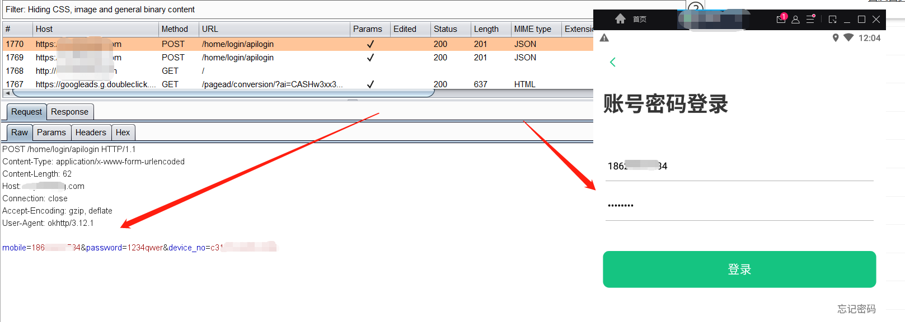
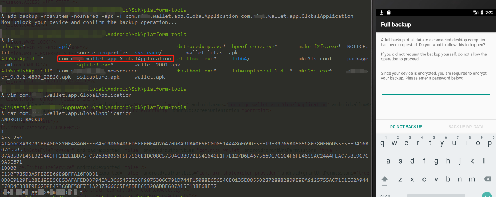
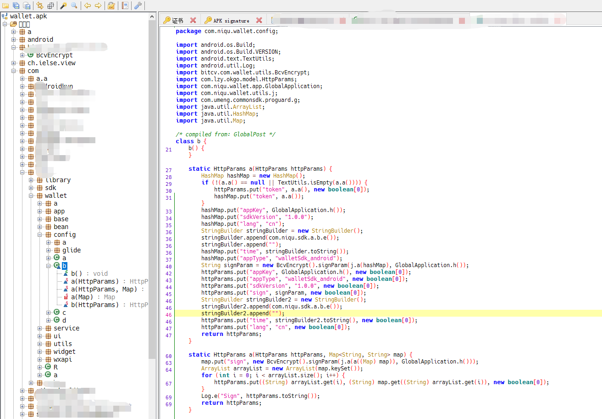
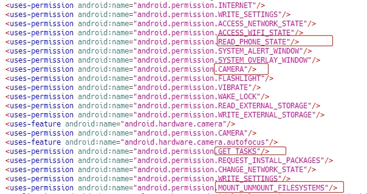
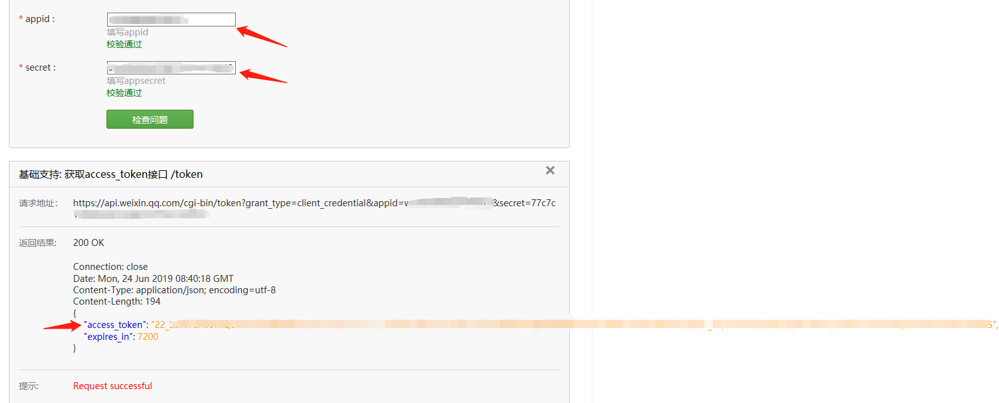

随着移动互联网的发展，如今移动设备已与我们的生活息息相关，但其安全性却一直没有得到足够的关注。

时不我待， 于无声处听惊雷，守护移动安全从现在开始。

<!-----more----->

## 一、App安全概述

如今，随着人们使用手机，平板等移动端设备上网的时间与频率增加，移动app的发展也是愈来愈迅速。各大交易所在与用户交互的这方面，除了网页浏览以外，也就是移动端的app了。

尽管app时下相当流行，但其安全性却一直没有得到足够的关注。在app安全的领域上，大部分厂商都做得比较初级，很多用户也不具备相对应的安全意识。由此，app也就变成了恶意攻击者的一个有效突破口。

零时科技安全团队在经过大量对app进行的安全测试之后，总结出了一份相对完整有效的测试列表，建议各大交易所以此自查，防患于未然。

## 二、测试列表

**App安全**

- App 运行时虚拟机监测
- App 运行时root监测
- App数据备份检测
- 代码反编译检测
- 敏感权限使用
- 敏感信息泄露
- 拒绝服务测试
- 目录穿越安全测试
- App 缓存安全检测
- 接口安全测试
- 弱加密安全测试

## 三、案例分析

### App 运行时虚拟机监测

零时科技在对某交易所进行发现，该交易app未进行虚拟机运行检测，攻击者在虚拟机中安装运行该app，即可在虚拟机中截取并操作数据包或进行其他有害操作。

### App数据备份检测

零时科技安全团队在对某交易所app进行安全测试时，发现该交易所并未对app进行数据备份检测，安卓AndroidManifest.xml文件中android:allowBackup为true，当这个标志被设置成true或不设置该标志位时，应用程序数据可以备份和恢复，adb调试备份允许恶意攻击者复制应用程序数据。

零时科技安全团队在对某交易所app进行安全测试时，发现该交易所并未对app进行数据备份检测，其AndroidManifest.xml文件中android: allowBackup为true，存在数据任意备份漏洞。

连接手机，然后输入以下备份命令，会出现一个对话窗，输入备份密码即可：

> adb backup -nosystem -noshared -apk -f com.xxx.wallet com.xxx.wallet

连接到另一台手机或root的本机，输入下列命令，弹出对话框，输入备份时的密码即可恢复数据

> adb restore com

如果用户账号密码保存在本地，则恢复到另一台root的手机后，可以看到各种敏感信息。

零时科技安全团队建议设置AndroidManifest.xml的android:allowBackup标志为false。

### 代码反编译检测

若app的apk文件可被反编译，就有可能导致源代码信息泄露，攻击者也可对其进行代码审计以找出可能存在隐患的攻击点。

零时科技安全团队对某交易所app进行安全测试时，通过检测apk文件是否通过加固，代码是否通过加密或者混淆，是否可以通过反编译攻击等方面对该app进行测试。发现该apk文件可被反编译，反编译后可以看到java源代码，导致源代码信息泄露。（通过jadx-gui或其他反编译工具可直接操作apk，查看java源代码。）

零时科技安全团队建议，可使用专业加固工具对apk进行加壳处理。

 ### 敏感权限使用

目前很多系统在app请求权限这一方面上都不甚敏感，这也是如今移动端并不那么安全的成因之一。很多app都会请求一些敏感的权限，有的甚至会直接绕过，不向用户请求就直接自行取得了权限。而这些app有可能对交易所和用户都产生足够的恶意影响。

零时科技安全团队在对某交易所app进行安全测试时，检测APP程序中是否存在敏感权限的使用，发现确实存在敏感权限使用漏洞。

 

敏感权限如下：

- android.permision.WRITE_EXTERNAL_STORAGE 允许应用写入外部存储

- ndroid.permission.READ_PHONE_STATE 允许访问电话状态、设备信息

- ndroid.permission.CAMERA 允许访问摄像头

- android.permission.GET_TASKS 允许获取系统应用列表

- android.permission.MOUNT_UNMOUNT_FILESYSTEMS 允许挂载、反挂载外部文件系统 

零时科技安全团队建议禁用不需要的敏感权限。

###  敏感信息泄露

敏感信息泄露危害极大，如泄露出测试/管理员数据，参数注释信息等。但它又是一种危害虽大却又较容易避免的漏洞，只要开发人员多加注重安全意识即可避免大部分问题。

零时科技安全团队在对某交易所进行安全测试时，查找其 app 程序文件中是否存在敏感信息泄露（如源码中，备份文件中，xml 资源文件中等），发现确实存在敏感信息泄露漏洞，源码中泄露了微信公众号 appid 和 secretkey：

获取token：

---

**随着移动互联网的发展，如今移动设备已与我们的生活息息相关，但其安全性却一直没有得到足够的关注。时不我待， 于无声处听惊雷，守护移动安全从现在开始。**

*鉴于文章内容长度限制，本期内容将分为上、下篇，顺序放送。*

本文由深入浅出区块链社区合作伙伴 - [零时科技安全团队](https://noneage.com/)提供。

[深入浅出区块链](https://learnblockchain.cn/) - 打造高质量区块链技术博客，[学习区块链技术](https://learnblockchain.cn/2018/01/11/guide/)都来这里，关注[知乎](https://www.zhihu.com/people/xiong-li-bing/activities)、[微博](https://weibo.com/517623789) 掌握区块链技术动态。