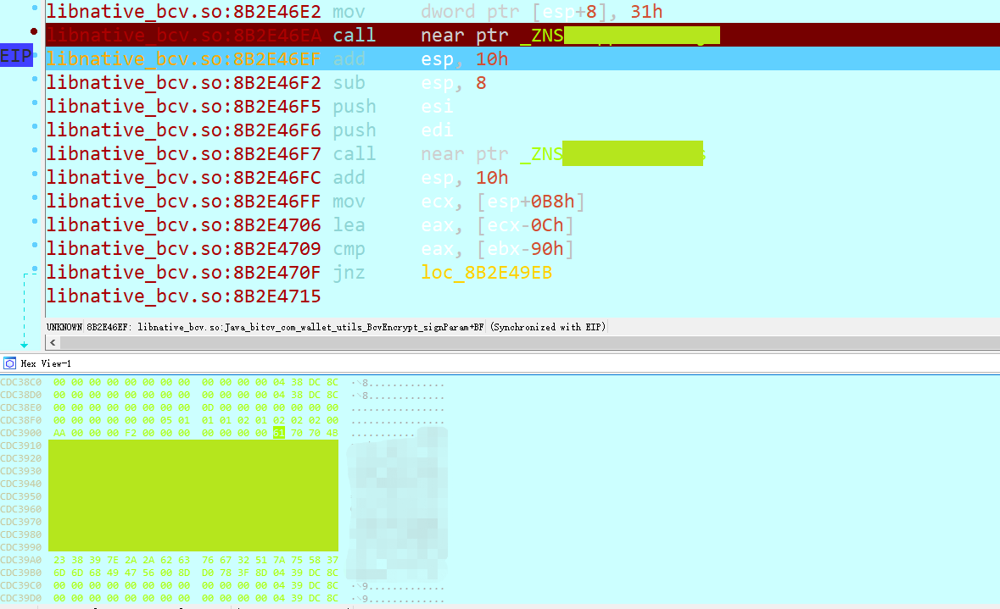
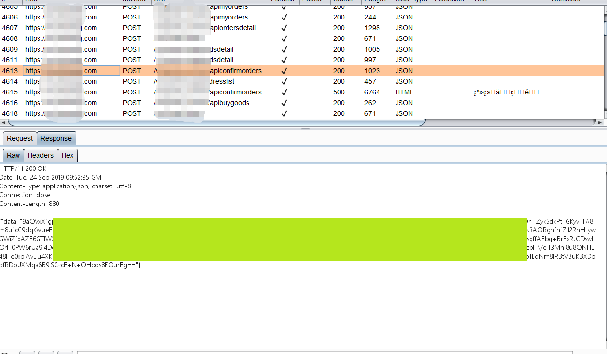
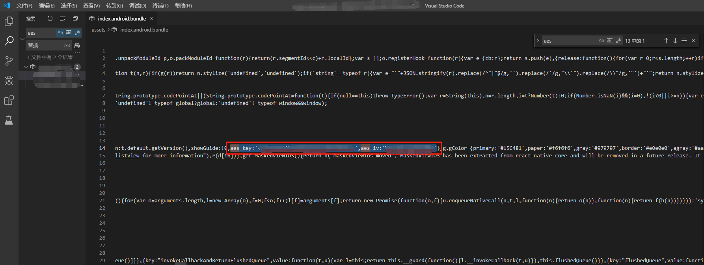
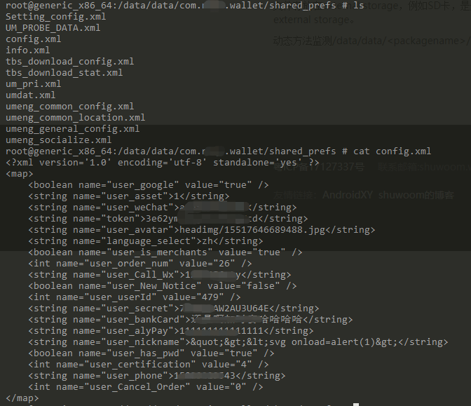
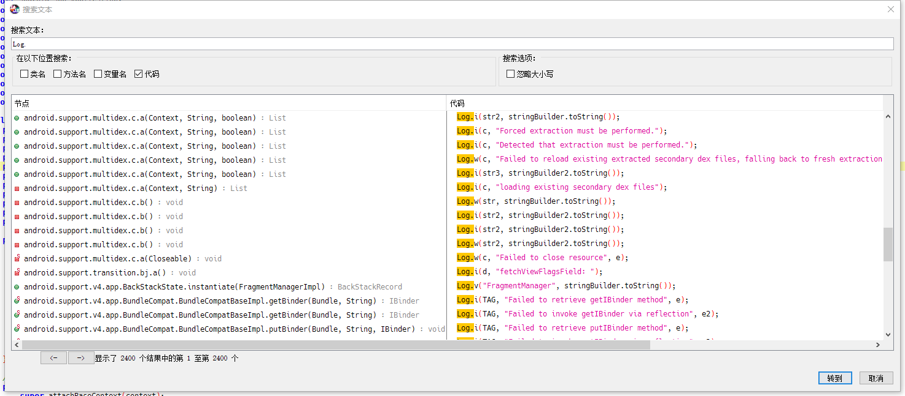
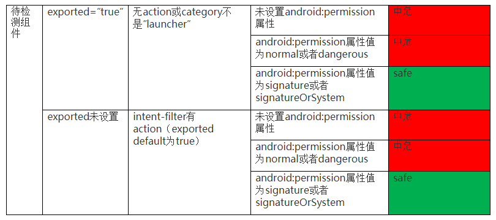

随着移动互联网的发展，如今移动设备已与我们的生活息息相关，但其安全性却一直没有得到足够的关注。

时不我待， 于无声处听惊雷，守护移动安全从现在开始。

<!-----more----->

## 一、App安全概述

如今，随着人们使用手机，平板等移动端设备上网的时间与频率增加，移动app的发展也是愈来愈迅速。各大交易所在与用户交互的这方面，除了网页浏览以外，也就是移动端的app了。

尽管app时下相当流行，但其安全性却一直没有得到足够的关注。在app安全的领域上，大部分厂商都做得比较初级，很多用户也不具备相对应的安全意识。由此，app也就变成了恶意攻击者的一个有效突破口。

零时科技安全团队在经过大量对app进行的安全测试之后，总结出了一份相对完整有效的测试列表，建议各大交易所以此自查，防患于未然。

## 二、测试列表

**App安全**

- 秘钥硬编码安全检测
- 数据存储安全检测
- 数据传输安全检测
- 日志信息泄露检测
- App组件导出检测
- App组件权限检测
- webview 多项漏洞安全测试
- App Webview DOM 安全测试
- 本地SQL注入安全测试
- SQLite 存储安全审计

## 三、案例分析

### 秘钥硬编码安全

被测试的app，若通信存在加密处理，即可检查源码或者静态资源文件中是否存在硬编码的加密秘钥，从而破解通信加密的数据。

零时科技安全团队在对某交易所app进行安全测试时，检查是否存在秘钥硬编码漏洞，此app请求数据默认是通过请求数据排列，然后加上appkey加上另外一个秘钥进行md5，再通过算法后去字符串再次md5得到最后的签名。

这里加密使用的appkey硬编码到apk中。如下图：

另一个加密key在so文件中，通过逆向可以获取：

这样一来即可通过修改数据后重新签名构造任意数据了，加签也就失去了意义。

*以下为第二个例子。*

零时科技安全团队在对另一个app进行测试时，使用burp工具截取该app传输的数据包，发现响应包内容已经过加密并有base64的特征。

对apk进行逆向获取到加密方式为aes cbc补码方式为pkcs7。

在反编译源码中未查询到aes秘钥相关信息 对apk进行解压 在静态资源文件中发现aes_key与aes_iv。

使用收集到的aes_key与aes_iv 以pkcs7为补码方式构造aes cbc解密获取到明文数据。

### 数据存储安全

如果安卓手机用户的app文件存放在external storage，例如SD卡，那这些文件就是全局可读写的，external storage可以被任何用户操作，且可以被所有的应用修改使用。

零时科技安全团队在对某交易所app进行安全测试时，使用动态方法监测/data/data/<packagename>/目录下所有生成的目录是否带有明文信息泄露。

进入到/data/data/com.xxx.wallet/shared_prefs目录，查看config.xml文件，此文件存储了用户的支付信息等非常敏感的信息，而这些信息可被其他用户接触导致信息被盗取等。

零时科技安全团队建议，app的敏感数据不要存放在external storage，如若不得不这样做，请对数据进行加密处理。

### 日志信息泄露

在APP的开发过程中，为了方便调试，通常会使用log函数输出一些关键流程的信息，这些信息又通常会包含敏感内容，如执行流程、明文的用户名密码等。这会让攻击者更加容易的了解APP内部结构方便破解和攻击，甚至直接获取到有价值的敏感信息。

零时科技安全团队在对某交易所app进行安全测试时，检测存在漏洞，程序中使用Log.v、Log.d、Log.e、Log.i、Log.w、Log.f、Log.s函数对日志信息输出，在反编译apk后，在源码中查找到日志信息输入接口函数，如下图：

零时科技安全团队建议各大交易所app开发人员移除Log打印。

### App组件导出检测

检测app中Activity、activity-alias、service、receiver组件对外暴露情况，如果检测到组件的exported属性为true或者未设置，而且组件的permission属性为normal或者dangerous或者未设置组件的permission属性时，app将存在组件导出漏洞，导致数据泄露和恶意的dos攻击以及钓鱼攻击。

零时科技安全团队在对某交易所app进行安全测试时，检测到该app存在Activity组件导出漏洞。

检测app中Activity、activity-alias、service、receiver组件对外暴露情况，先检测组件的exported属性，再检测组件的permission对应的protectionlevel属性。

具体检测存在漏洞的方法如下:

零时科技安全团队建议：

- 最小化组件暴露。对不会参与跨应用调用的组件添加android:exported=”false”属性。

- 设置组件访问权限。对跨应用间调用的组件或者公开的receiver、service、activity和activity-alias设置权限，同时将权限的protectionLevel设置为”signature”或”signatureOrSystem”。

- 组件传输数据验证。对组件之间，特别是跨应用的组件之间的数据传入与返回做验证和增加异常处理，防止恶意调试数据传入，更要防止敏感数据返回。

### SQLite 存储安全

此类安全问题的检测，使用adb工具将sqlite数据库拖到本地，使用sqlite数据库连接软件查看是否存在敏感数据即可。如下为零时科技安全团队测试某交易所app发现的漏洞范例。

---

**随着移动互联网的发展，如今移动设备已与我们的生活息息相关，但其安全性却一直没有得到足够的关注。**

**时不我待， 于无声处听惊雷，守护移动安全从现在开始。** 

*零时科技安全团队《交易所安全测试》系列的文章到这里就结束了，但我们还有很多没有说，请期待下一系列的文章，一定更加精彩！*

本文由深入浅出区块链社区合作伙伴 - [零时科技安全团队](https://noneage.com/)提供。

[深入浅出区块链](https://learnblockchain.cn/) - 打造高质量区块链技术博客，[学习区块链技术](https://learnblockchain.cn/2018/01/11/guide/)都来这里，关注[知乎](https://www.zhihu.com/people/xiong-li-bing/activities)、[微博](https://weibo.com/517623789) 掌握区块链技术动态。